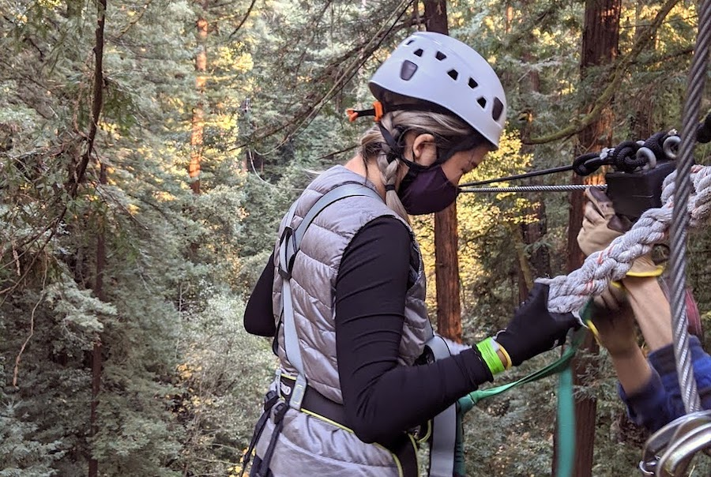
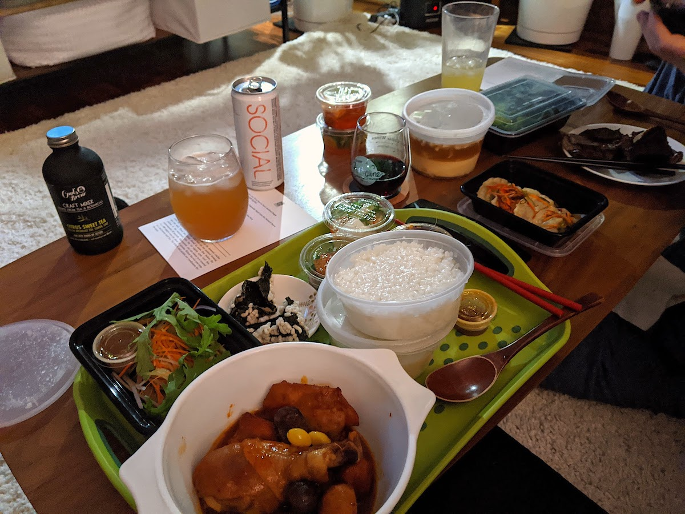
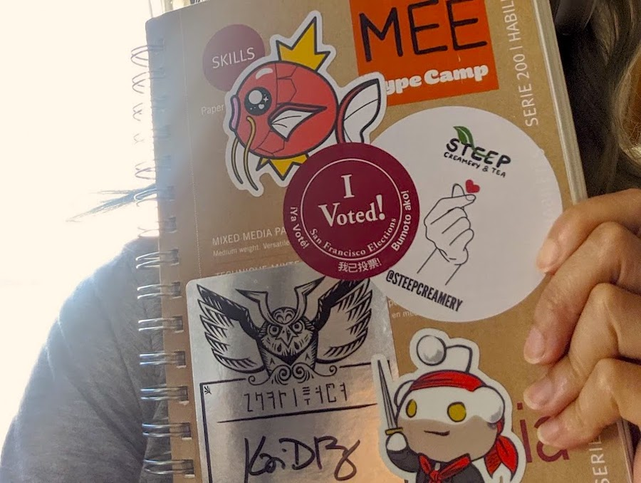
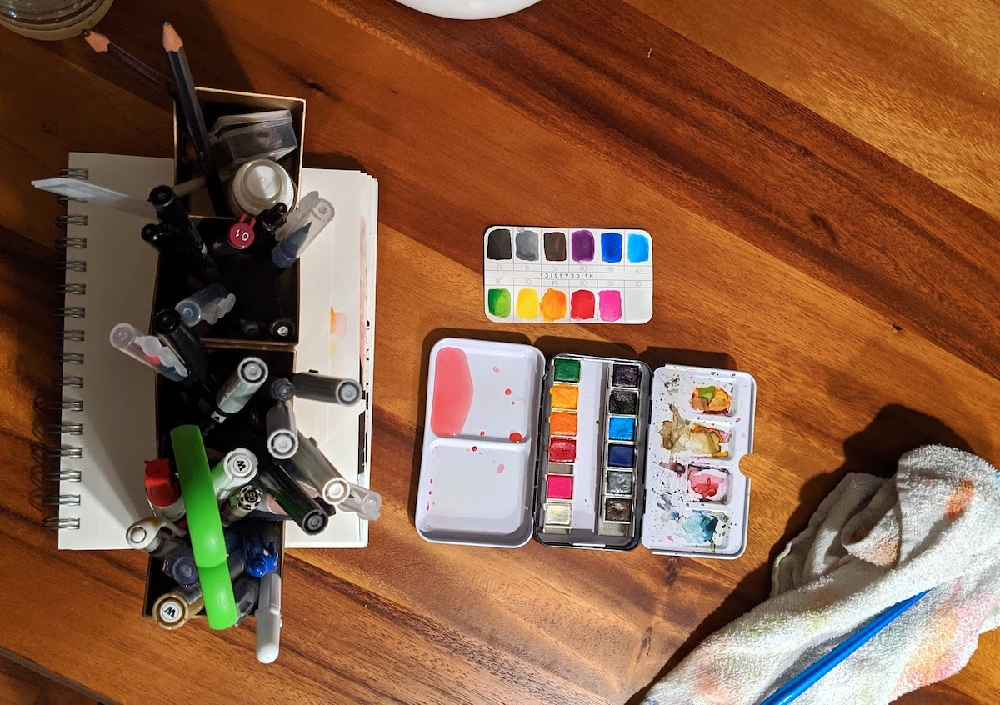
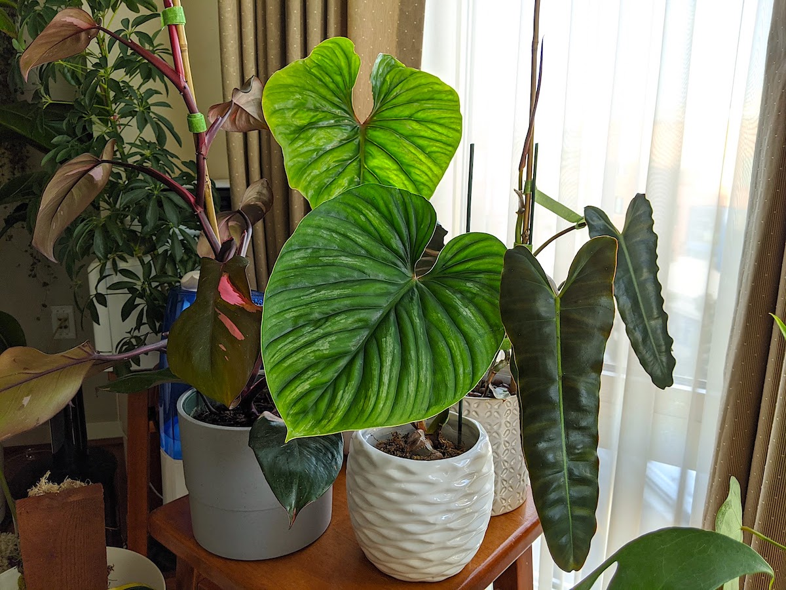
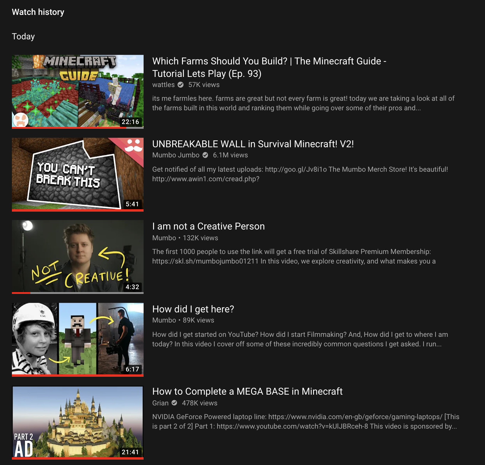
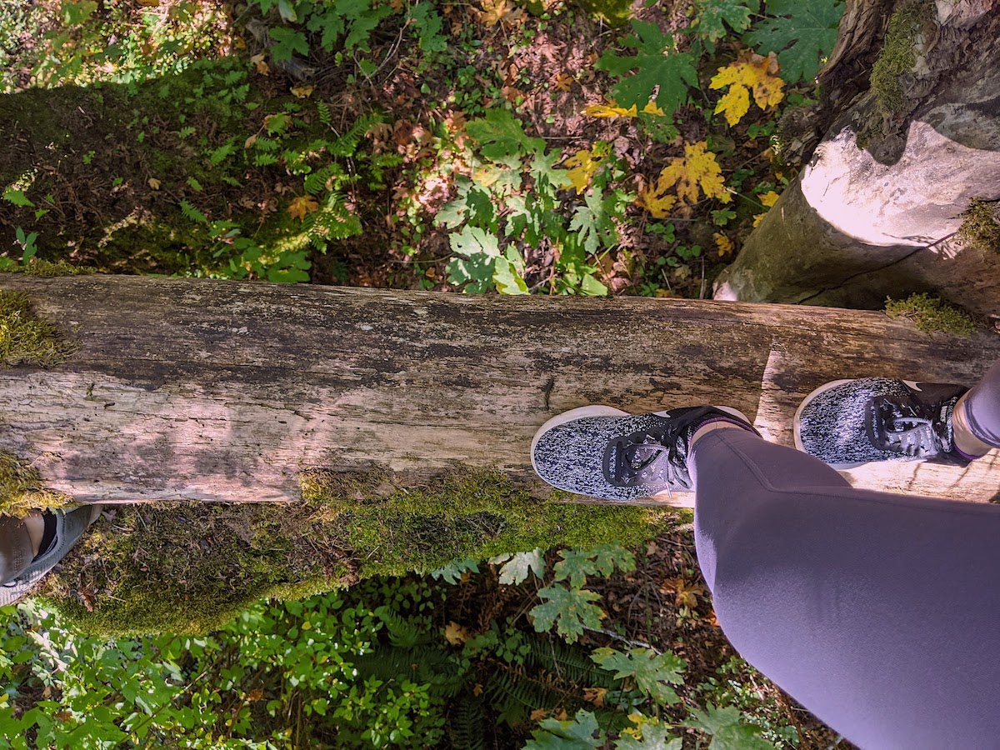
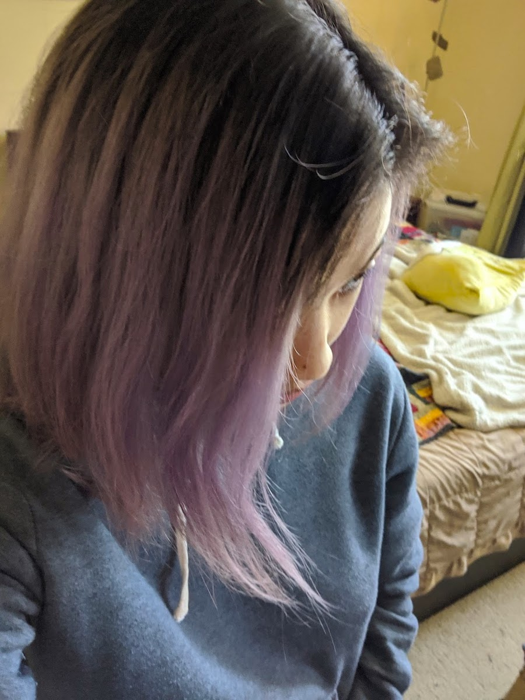
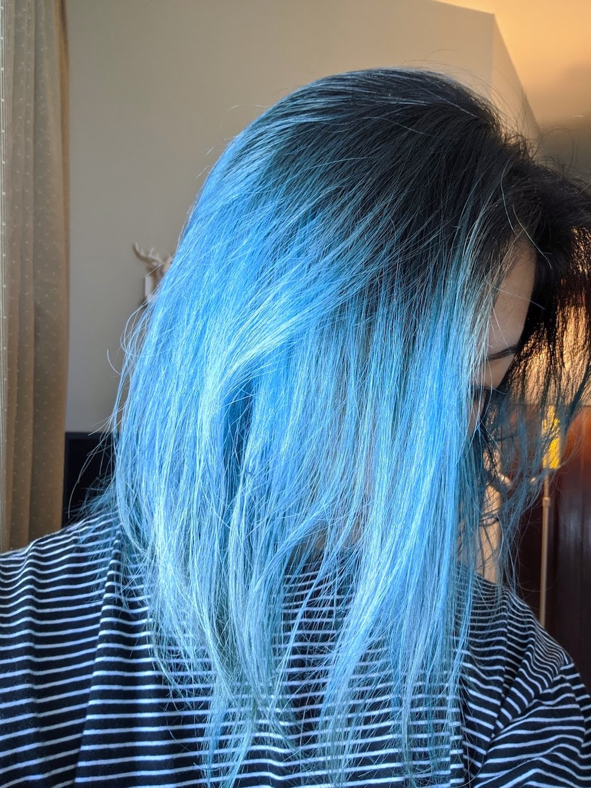

It's been a hot minute. Let me shape my world right now since I didn't get to do a proper reflection and didn't write much last year.

- We're a year deep within the Covid-19 pandemic.
- I still work at home and stay mostly at home. I occasionally leave to pick up my prescription, walk the dog, or run.
- My workplace has had three rounds of layoffs since the stay-at-home policy took place.
- Most of the photos I took in 2020 were of my cat [Fuwa](https://www.instagram.com/fuwa_the_exotic).

## Unintended consequences (neither good nor bad)

- I've gotten closer and further from some friends due to covid: some I work with better during virtual hangouts, others where our in-person spots were where we could unwind.
- I started to play more games. It has become a time sink and caused me to change my sleep schedule. Before covid, I was in bed around 10 pm and woke up at 7 am. These days, it's normal for me to sleep past midnight (2 am on Fridays/Saturdays) and get up at 8 am.
- I enjoy eating in. We started to order to-go every Friday and set it as a weekly treat.
- Got into the routine of catching up on daily local and national news.

## Disappointments in myself:

- I didn't do as much art or writing as I thought I would.
- I couldn't keep up my exercise routine now that I have zero access to free weights. I was on a running and HIIT routine, but that went to a stump during December 2020.
- I got into a houseplant phase. I have acquired a lot as a form of distraction and enjoyment, but not into them as I was in mid-2020. It turns out I like the common plants more than the "fancy" harder-to-find varieties.

## Things I learned about myself:

- When I get into something (like a new hobby), I go in deep. Tropical houseplants and Minecraft are two.
- I'm genuinely OKAY staying at home for extended amounts of time as long as there's space for me to do work.
- I can eat the same breakfast, lunch, and dinner daily.
- I have a short attention span. I started watching YouTube at 1.5x and listening to podcasts at 1.25x speed.
- I learned to appreciate running because it helps with my hiking.

## Silver linings:

- I spent more time building a mutual/better understanding of what I want and what he wants in the next 5-10 years and after.
- I got more experimental with hair colors.
- I started a podcast with my friend about our Asian American experience.
- I received a promotion into the managerial track as Engineering Lead.

Welp, it's only the beginning of this year, but it's flying by so fast. I hope we can soon reach herd immunity with these promising vaccines to continue life as we had before: socializing with family, friends, and loved ones without these precautions.
