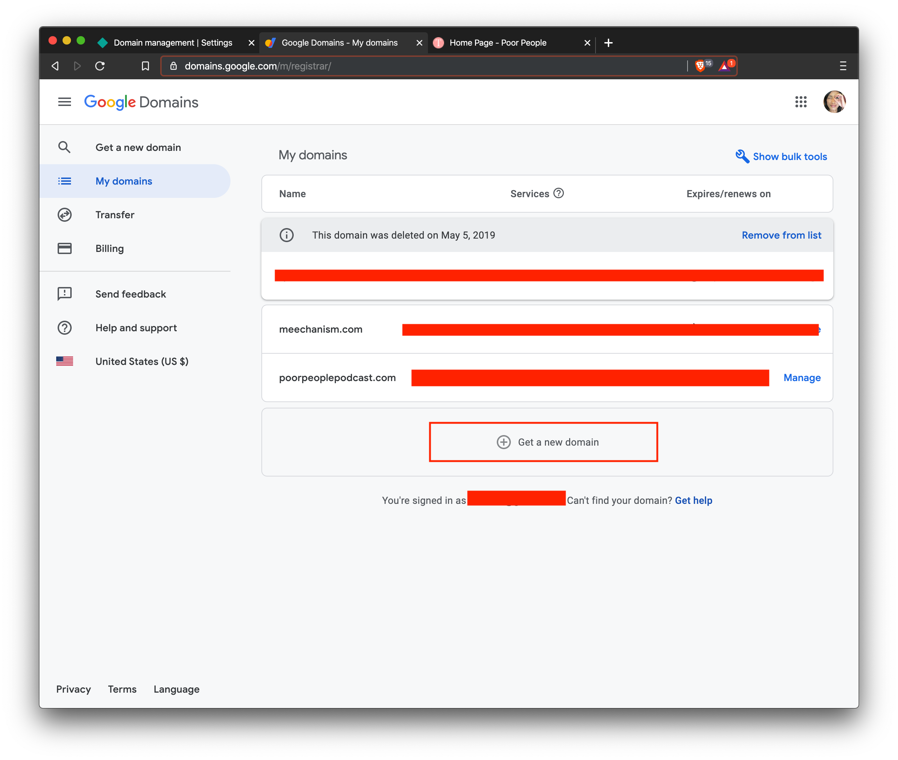
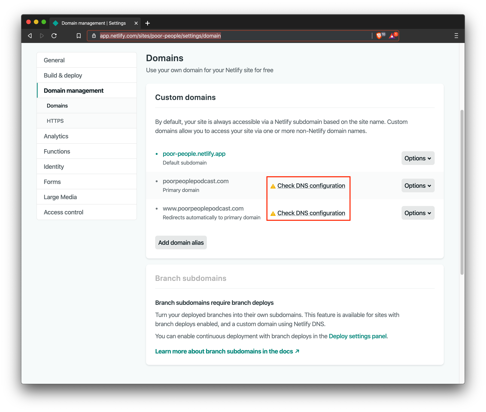
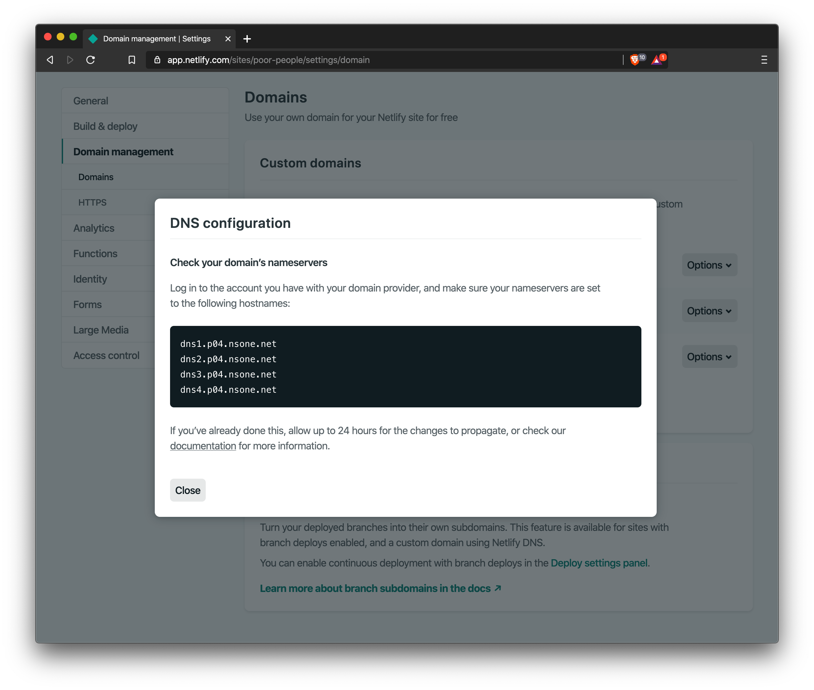
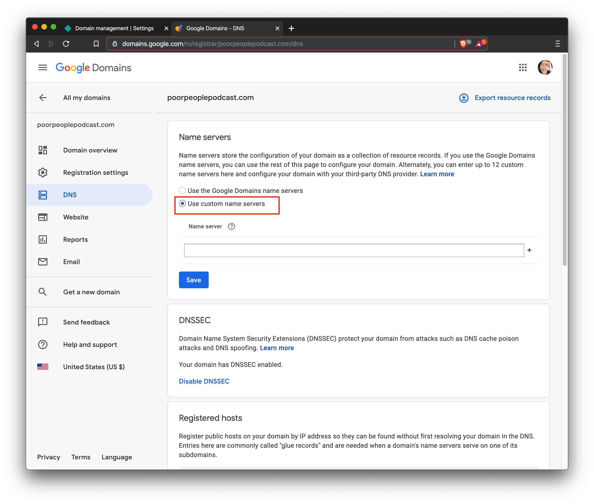
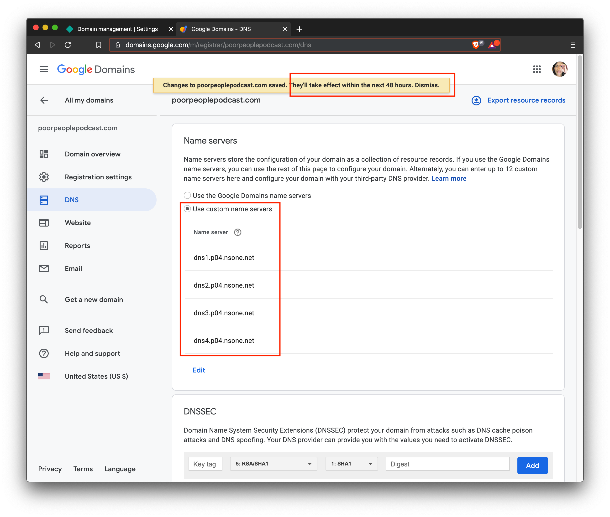
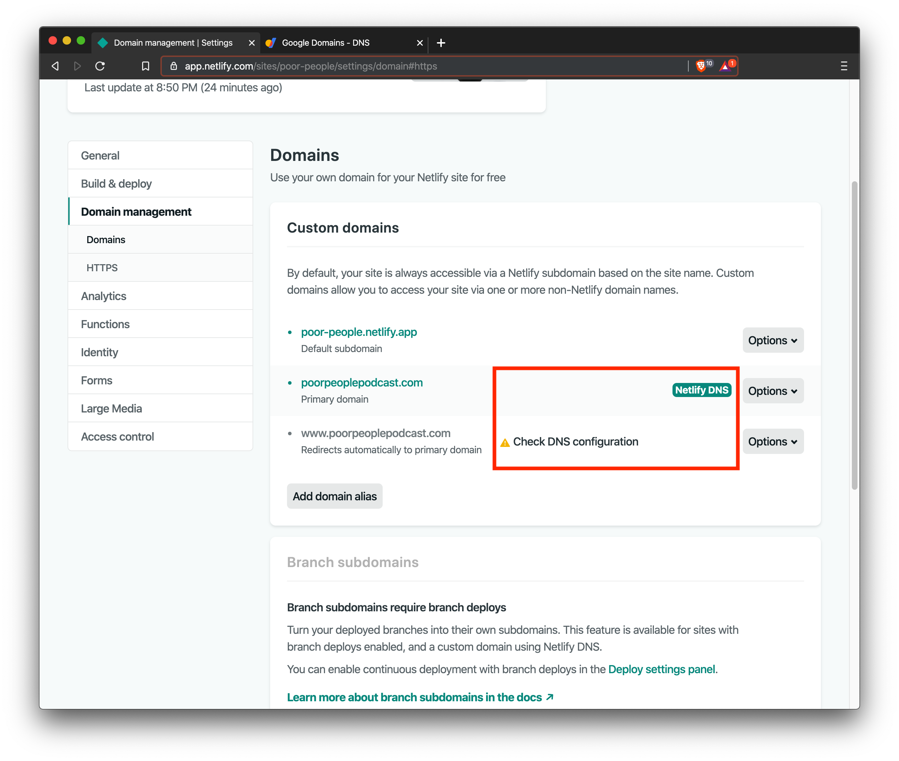
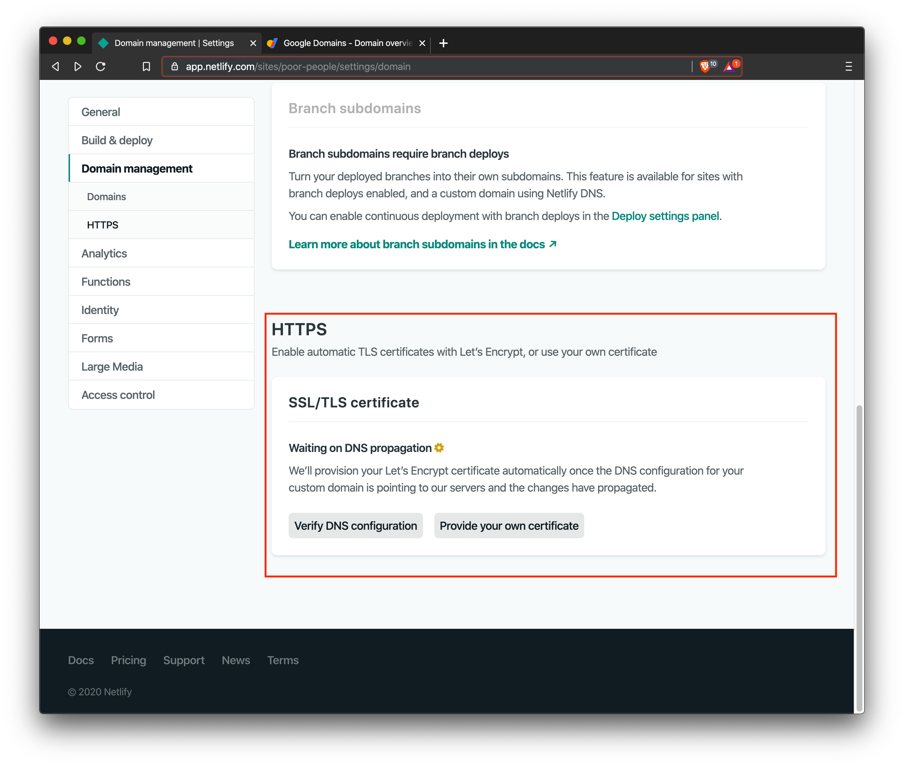
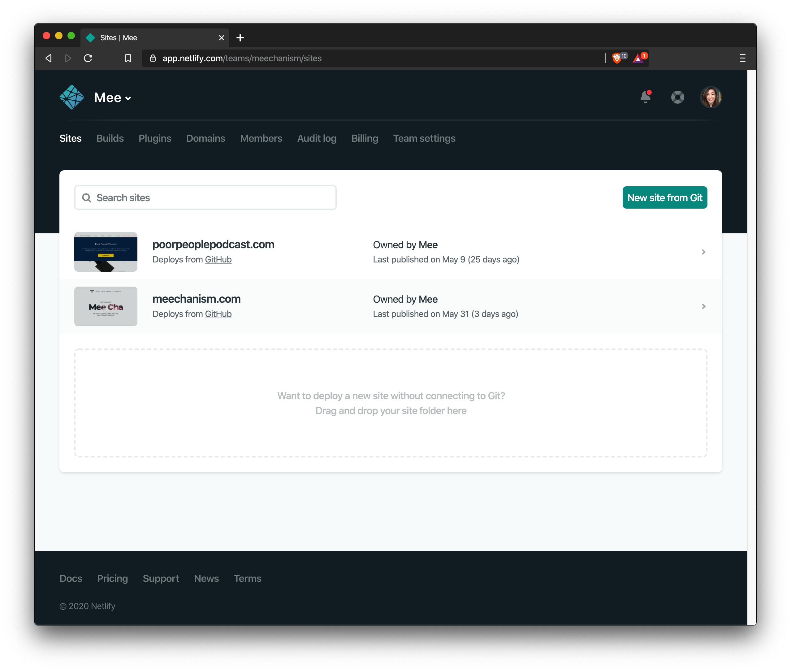

I've previously added a [custom domain](https://docs.netlify.com/domains-https/custom-domains/#assign-a-domain-to-a-site) to my [Netlify](https://netlify.com) website for my site (this one) and I need to do it again for my podcast [Poor People](https://poorpeoplepodcast.com). I figured I'd document it this time since I looked up the same documentation as last time on specific steps.

### Assumptions:

- You already have your Netlify app connected to your codebase (such as [Github](github.com)).
- You already have your Netlify app deployable from your codebase to a netlify env, eg: [https://poor-people.netlify.app/](https://poor-people.netlify.app/)

### Some terms:

- _DNS_: Domain name system
- _Domain Name_: a human-readable, easy-to-remember name associated with an IP (internet protocol) address. Example: it's easy to remember google.com as opposed to something like 172.193.44.31 (the address of where the webserver is hosted)
- _DNS Propagation_: In really general terms, it's a way of letting all the domain name servers know that you have updated your address (e.g.: your domain name points to some new IP and all the nameservers that identified your previous IP need to update to your new location). Think of it as updating your residential address in an address book because you moved across town. Propagation can take 1-2 days to fully globally complete.

## Part 1: Purchase Domain

Purchase your domain. I've been using [Google Domains](https://domains.google.com/) as my registrar and the following tutorial will show screenshots of their UI. I have found Google Domains to be relatively hassle-free and they have a clean UI/UX.

As of making this post, a domain name for one year costs \$12 USD and comes with free privacy protection.

## Part 2: Add Netlify Custom Domain

1. Select your project in Netlify.
2. Find the option for `Domain Management`.
3. Under `Domains`, add a `Custom Domain`.
4. Type in your domain name, and when prompted if the domain is yours, select YES.
5. Back on the `Domains` screen, click on the `Check DNS configuration` link.

6. A modal lightbox dialog will pop up with a list of nameservers. Keep these handy for the next section.

## Part 3: Update domain name servers

1. Go back to Google Domains.
2. Select your domain.
3. Select the `DNS` from the side menu. By default, the name servers list will populate name servers for the `Use the Google Domains name servers` option. But we don't want that. Select `Use custom name servers` instead.

4. Paste in the four name servers provided to you from the previous part. Note that this can take 1-2 days to propagate.

Once you update the name servers on Google, you _may_ see some updates on the Netlify side within minutes. As you can see here, the `poorpeoplepodcast.com` has see the dns updates, but `www.poorpeoplepodcast.com` is still work in progress. About 10 minutes later I saw the `www` flavor also go green. Again, this can take a couple days to FULLY propagate!

## Part 4: Turn on HTTPS for your Netlify domain

Netlify is partnered with [Let's Encrypt](https://letsencrypt.org/) and allows you to add [https](https://www.howtogeek.com/181767/htg-explains-what-is-https-and-why-should-i-care/) for free. I highly recommend you turn on this feature.

1. Go back to Netlify and select your project.
1. Scroll to the bottom of the `Domain Management` screen and turn on DNS verification.
1. Provisioning for the first time can take 24 hours.

## Part 5: Waiting game

Try going to your new domain and see if your website loads. If it does, congratulations, you have successfully set up your domain with Netlify!

If it doesn't work, don't fret! You may just have to wait a bit longer for DNS propagation. Check again in a couple of hours or the next day. Also, ensure that your site is deploying successfully.

## Conclusion

I hope that was helpful! I thought were was a couple of other steps for some reason, but my site seems to have worked. If I recall what they were, I will update this post.
