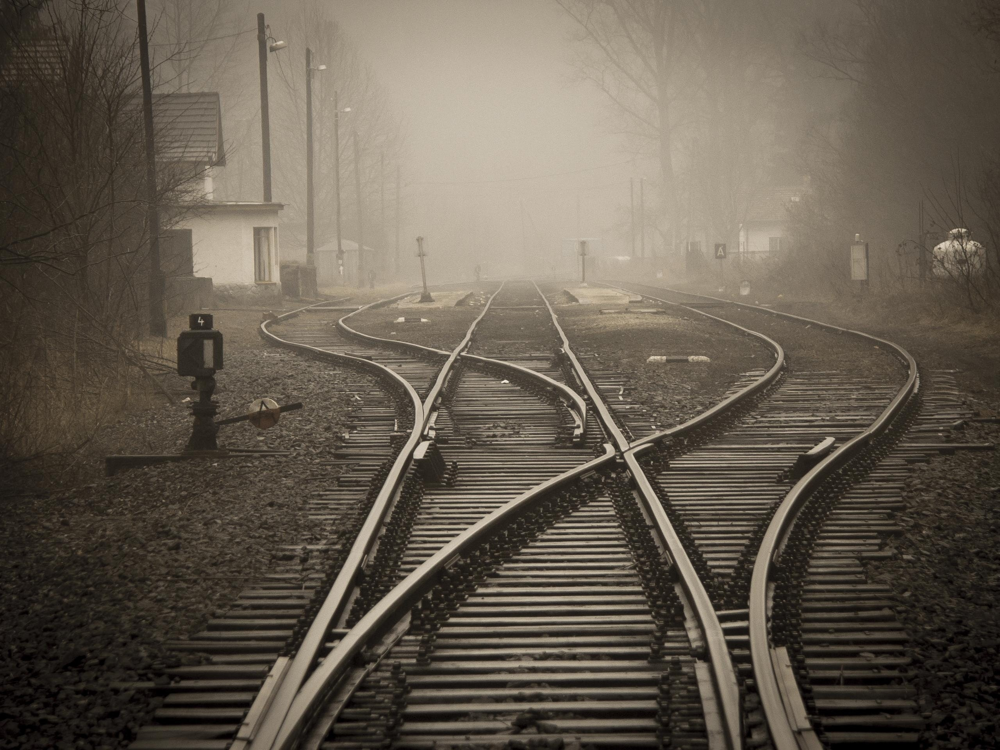
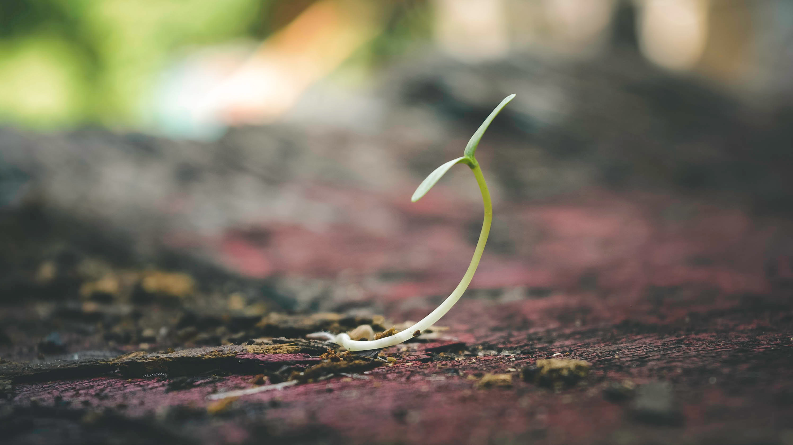

I'm currently unemployed (spoiler alert: Silicon Valley tech company meltdown).

I'm surprisingly enjoying it.

<figure>
  
  <figcaption>The world is beautiful. So is freedom. Photo by <a href="https://www.pexels.com/@8moments">Simon Matzinger</a></figcaption>
</figure>

I haven't had a break in between jobs since... ever. I graduated from university on a Friday and I worked that following Monday. Since then, whenever I left a job (or if a company exploded), I started again the next available week. This happened non-stop for 9 years.

_I finally get a chance to breathe._

At first, I felt okay knowing my severance package would last me a couple of months. I soon grew anxious thinking, "Why aren't I worried about not having a job?" and then continued getting more concerned about that dreadful software engineering interview process.

Then something unexpected happened: I started to like being unemployed. I had so much time to work on projects and to run (important) errands I have been putting off.

<figure>
  
  <figcaption>Time + coffee + paper = creative mind at work. Photo by <a href="https://www.pexels.com/@kaboompics">@kaboompics</a></figcaption>
</figure>

There was time to write. I got more time to learn photography. I intimately hung out with a friend I haven't seen for almost a decade in a country I have never visited. I got my finances in check, put together a solid retirement plan and a shorter-term 10-year portfolio goal. I got some dental deep cleaning done in two problem areas. I started working on my website again, which is still lacking so many things I want to add in.

And most importantly, it allowed me the chance to think clearly about my values and priorities. It got me wondering; _work truly sucks_.

I understand some people find work fulfilling, as it may be one of the core pillars of their values and definitions of success. But for me, I don't want to work for the sake of making a living. That sounds like a waste of life. I want to work for meaning. I want to work for something impactful. The way I have been working just hasn't been... working for me.

<figure>
  
  <figcaption>Deep and not-so-happy thoughts. Photo by <a href="https://www.pexels.com/@blaque-x-264516">Blaque</a></figcaption>
</figure>

I quickly grew resentful at the thought of my life: working 5 days a week, 9:00 am-6:00 pm (me in tech), and too tired/lacking enough time to do anything creative or productive once I get home. Rinse and repeat. What a sad living. I don't want to continue doing this.

I LOVE building things. I love learning new efficient ways to build these things someone needs. I just want to do it for a meaningful purpose, something that impacts someone's life, impacts society. Can't I do that for a good cause? Can't I just work for a company, to build a service or product, that helps someone? Even if it's for a mum/pop bakery, I think that's a pretty good direct impact. I'm probably going to have to take a pay cut, but I'm okay with it.

I'm finding ways to fill in the free hours with activity. I'm starting to struggle to find a company that will get back to me about my application though. Turns out cold applications are hard to get across! I have connections to plenty of startups and some big companies that don't necessarily match my values, but I'm wanting to put my values first.

<figure>
  
  <figcaption>Multiple tracks, but forward. Photo by <a href="https://www.pexels.com/@pixabay">Pixabay</a></figcaption>
</figure>

My problem now, then, is how long am I willing to wait for the right opportunity? I'm not wealthy and still have to pay the bills and build something for my future. I'm not quite at that point where I am willing to leave the tech industry, but I am getting close.

Wouldn't it be nice to live in a home I own and have a job where I can use my two hands doing some kind of trade? I want to be a cobbler. I want to own a romantic bed and breakfast with a nice garden and some goats. I want my friend to be my cook.

<figure>
  
  <figcaption>Bloom in process. Photo by <a href="https://www.pexels.com/@gelgas">Gelgas</a></figcaption>
</figure>

Let me dream while I'm unemployed. It won't last forever, but I'm thankful for having a breath of fresh air and time to think about what is important to me. That is invaluable.
