I've had the itch to learn photography for over a decade. Let's be clear, I take photos of food pretty often on my phone, but that's just for plain old fun. The type of photography I'm talking about is the real deal, the stuff you see in magazines, the stuff you pay people for when you need to look really good.

<figure>
  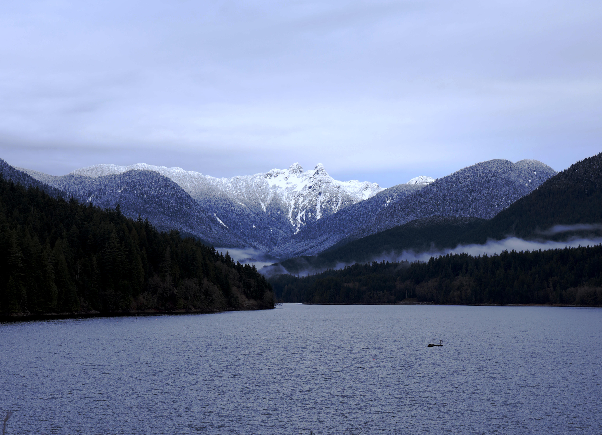
  <figcaption>This view of the <a href="https://www.vancouversnorthshore.com/things-to-do/parks/capilano-river-regional-park/">Capilano Lake</a> took my breath away. And the photo does zero justice. Send help. Dec 2019</figcaption>
</figure>

I love staring at stunning shots of majestic landscapes, serene and magical portraits of couples in orchards, and flipping through magazines filled with photos of vibrant displays of culture in places I've never been.

A photographer's careful, or even spontaneous, composition combined with a keen eye for capturing the perfect moment has always so inspiring and captivating. It's amazing! It is art!

But this is what people hire professionals to do, right?

<figure>

<figcaption>Tandoori platter <a href="http://www.copperchimney.ca/">Copper Chimney</a>. Obviously not a food photographer. Look at that focus on the had instead of the food. Dec 2019</figcaption>
</figure>

I slowly discovered this is what I want to do for the places I visit and with the people important to me. I want to capture my own moments. I want to learn the same or similar techniques that inspire me.

The question is, where do I even start?

Perhaps the only thing holding me back was that the photography ecosystem seemed intimidating: expensive equipment (camera, lenses, accessories), expensive software, and lots of technical terminologies to learn. It pretty much stopped me in my tracks. It seemed like there was so much I didn't know. Unknowns paralyze me.

## Enough stalling

Earlier this month, I took the first step forward to learn the basics of photography. I hoped it'd be a big enough spark to keep my motivation flowing.

What started all of this? Self-sufficiency! I usually travel with my boyfriend and he's the one documenting on devices other than a smartphone. I was going to travel to Vancouver without him and wanted to be armed with something more than my phone: his Canon EOS R mirrorless digital camera.

<figure>
  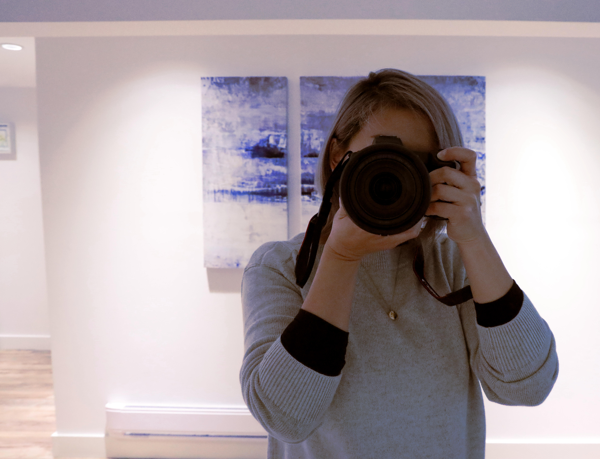
  <figcaption>Shooting a photo of myself with the Canon EOS R, Dec 2019</figcaption>
</figure>

A week before my trip, I sat down with my boyfriend to go through some photography terminology. Along with this, I signed up for an Airbnb experience with [Anthony](https://photohere.com) and practiced getting comfortable with the camera in the city.

## Basics

There are three key elements in the triangle of exposure: ISO, aperture, and shutter speed. Finding a balance in these will help determine the quality of your image capture.

#### ISO (International Organization of Standardization):

- Measures the sensitivity of the image sensor
- Lower ISO = less sensitive to light (finer grains)
- Higher ISO = more sensitive to light (coarse grains)

#### Aperture

- Measures the opening of a lense's diaphragm through which light passes. I think of it as an eye's iris dilating and contracting.
- Measured with an f-number (or f/stop) to express the size of the lens opening
- Lower f/stop = more exposure (larger aperture)
- Higher f/stop = less exposure (smaller aperture)
- Generally, a large aperture results in a larger foreground and background blur (a shallow depth of field). A small aperture provides a small amount of foreground and background blur (wide depth of field).

<figure>
  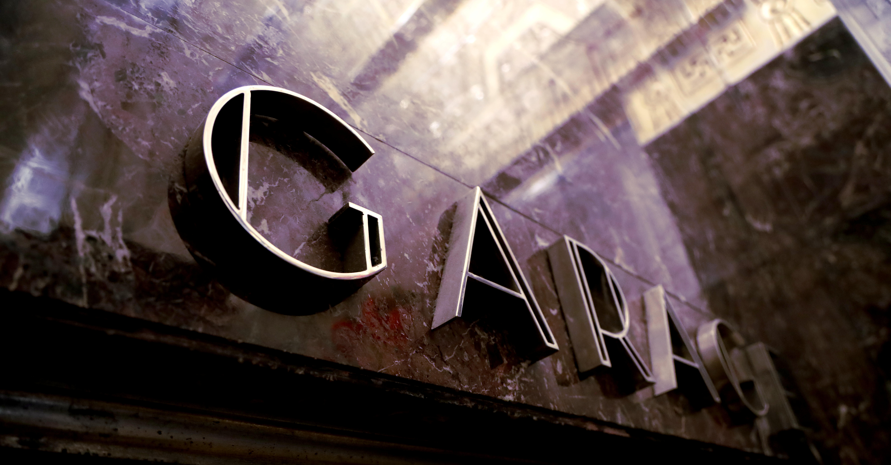
  <figcaption><a href="http://www.450sutter.com/">450 Sutter</a> building garage sign at f/4, Dec 2019</figcaption>
</figure>

#### Shutter speed

- Measures the amount of time the shutter is open, which allows light to hit the camera's sensor or film.
- A long (slow) shutter speed allows the lens to record more light, increasing the exposure time.

## Notes on harmonies with shutter speeds

- Use a low ISO to capture more light without slowing down the shutter speed or opening up the aperture.
- Use a high ISO to enable faster shutter speeds to freeze the movement of your subject.
- Stopping down (reducing aperture) reduces the amount of light entering the lens, which will require a longer (slower) shutter speed to capture an image.

## Some rules of composition

These are some rules I learned from my session with Anthony. Some are simpler to remember than others, so I found it helpful to have this list readily available in case I need some ideas or inspiration.

1. RULE OF THIRDS: try to mentally divide your image using a 3x3 grid (if your camera can display one, you can use it as a guide). Position the important elements in your scene along with the lines and/or intersection points.

1. BALANCE: Balance the weight of your subject by including other elements.

1. LEADING LINES: guide the viewer’s eye through an image. It helps draw focal points.

   <figure>
   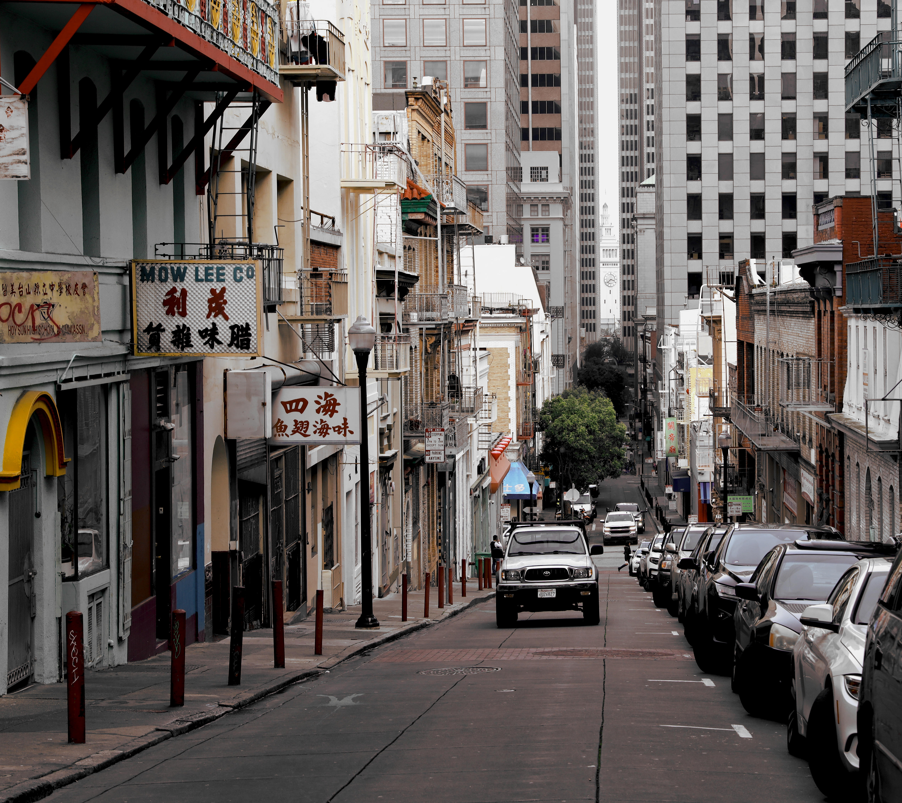
   <figcaption>A road off of China Town. Ferry Building in the distance. Dec 2019</figcaption>
   </figure>

1. VIEWPOINTS: to impact your composition with multiple points of interest.

1. BACKGROUND: compose your shot so it doesn’t distract or detract from your subject.

1. SYMMETRY & PATTERNS: both natural and man-made can make for very eye-catching compositions.

   <figure>
   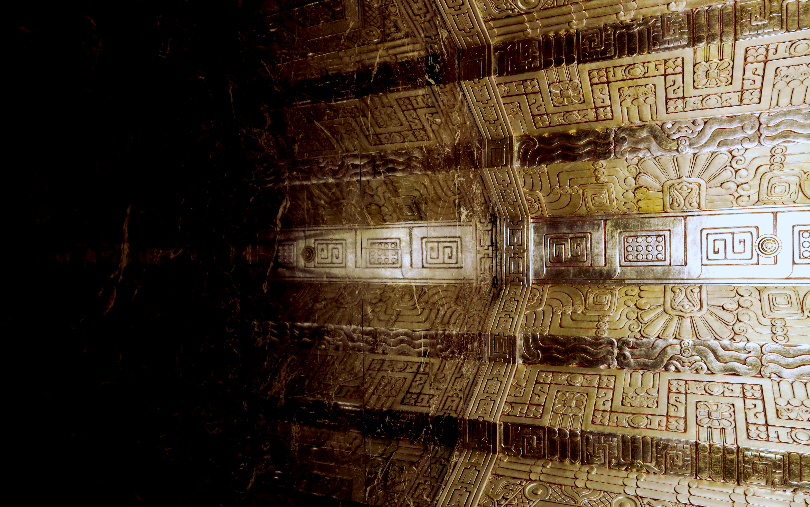
   <figcaption>Reflection of <a href="http://www.450sutter.com/">450 Sutter</a> ceiling details, Dec 2019</figcaption>
   </figure>

1. DEPTH: include objects in the foreground, middle ground, and background.

   <figure>
   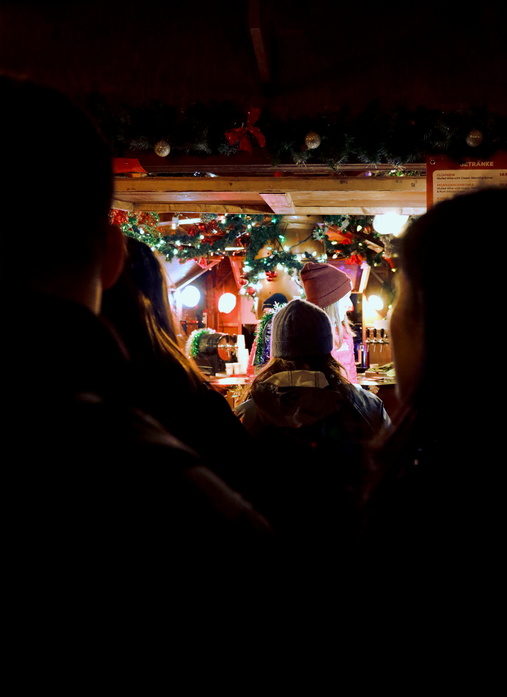
   <figcaption>Vancouver Christmas market line, Dec 2019</figcaption>
   </figure>

1. FRAMES: isolate the main subject with a frame around the edge of your composition.

   <figure>
   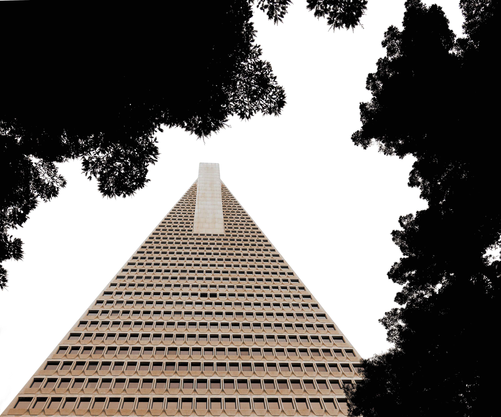
   <figcaption>Transamerica building framed by trees, Dec 2019</figcaption>
   </figure>

1. CROP: shoot or cut tight around the subject to eliminate background noise.

   <figure>
   
   <figcaption>Red buildings, edge of Chinatown, Dec 2019</figcaption>
   </figure>

   <figure>
   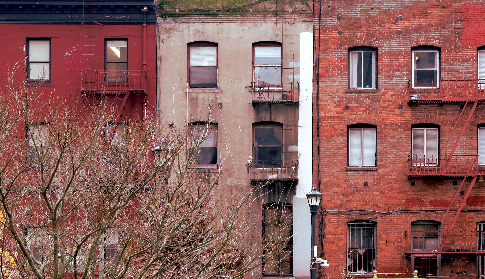
   <figcaption>Cropped gingko tree out of red buildings photo, Dec 2019</figcaption>
   </figure>

1. Experiment and have fun!

I need to remember #10. The reason why I was afraid of trying photography with cameras other than my phone was that I had no experience. I didn't want to use something without knowing anything about it. It turns out you need to take photos and learn through trial and error to gain experience!

## Challenge yourself

During my time shooting in the city, I learned of a neat challenge to help me focus on shooting quickly, rather than spending too much time and being stressed out about getting something done perfectly. Again, perfection comes to bite me in the butt!

I forgot the name of the challenge (maybe it was 2x20?), but these were the goals:

1. Pick one subject.
2. Shoot for 2 minutes.
3. Get at least 20 compositions.

To get different compositions, you can shoot for scale (small/medium/large, up close, from afar), from different angles (top, level, below, side), abstractly (zoom in, capture the space around/between the subject), move several feet to the left/right, and etc. The idea is to keep moving and keep shooting.

<figure>
  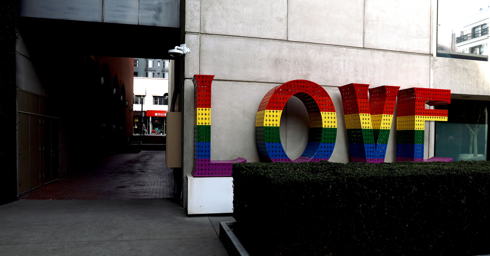
  <figcaption>LOVE sign from the front, Dec 2019</figcaption>
</figure>

When I did this challenge, some of the photos I found that looked the best were really surprising; they were of shots I would have never traditionally taken. This challenge helped me build new ideas and techniques I can reuse in future shots. It also forced me to get creative, which is nice especially if I find myself in a rut.

<figure>
  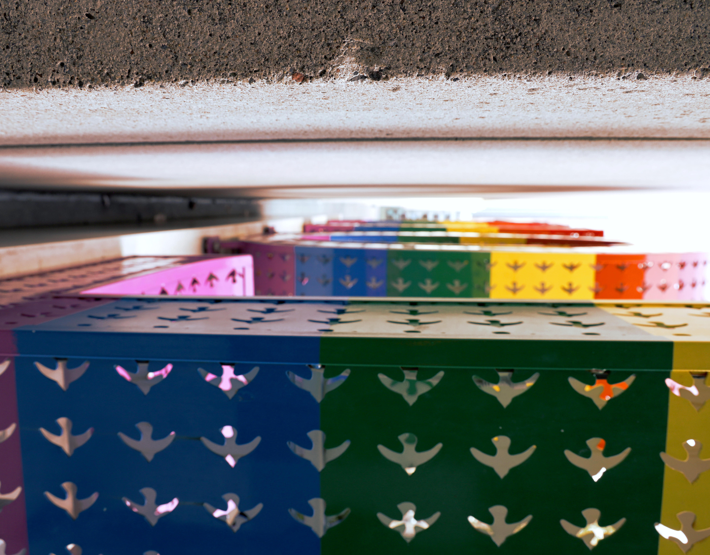
  <figcaption>A tight space between the LOVE sign and the wall, Dec 2019</figcaption>
</figure>

## Conclusion

I'm happy I finally started to make myself feel comfortable with a camera. I have only started to take photos, learned the basics of composition and terminology, and have not yet started to seriously edit them with post-processing software. To be honest, I only have [GIMP](https://www.gimp.org/) installed on my laptop! I will have to report back on my experience there!

<figure>
  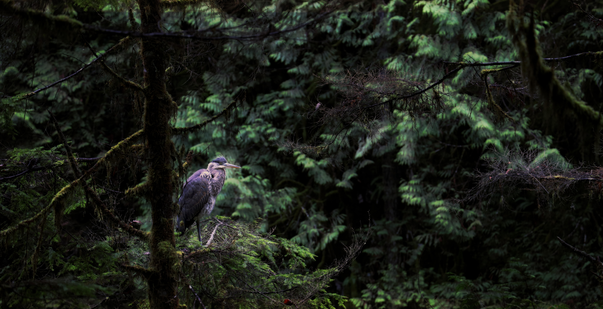
  <figcaption>Bird sighting during the hike around Cleveland Dam, Dec 2019</figcaption>
</figure>

My biggest lesson learned is to continue to shoot photos, even if the shot is awkward to get, I must be patient. I also need to keep my eyes open for opportunities (look up)! I'm excited to practice more and to continue to learn! There are so many types of shooting styles I want to do (like portraits), so I have a lot to look forward to.
