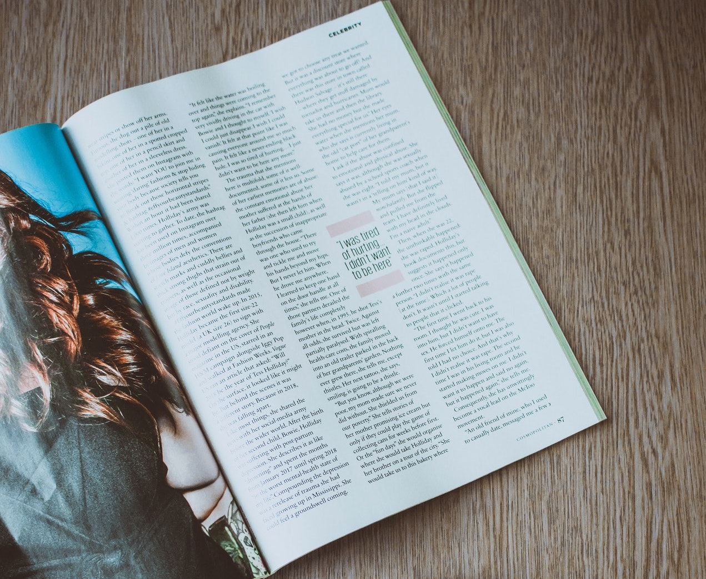
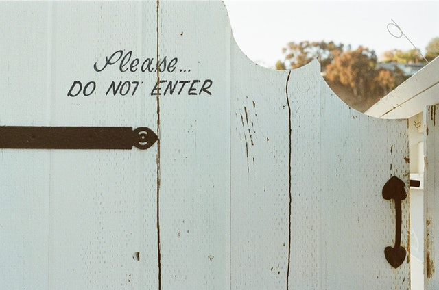
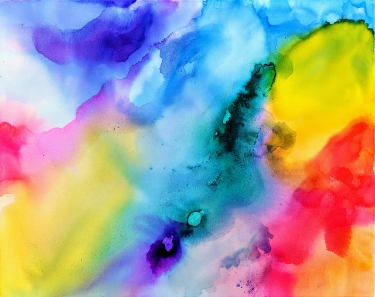
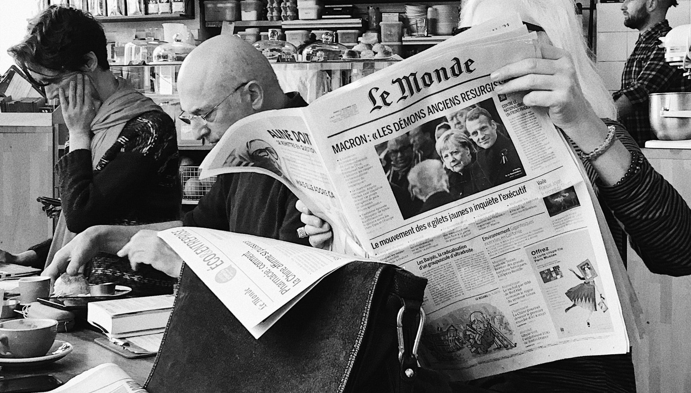

I'm not sure whether to file this under `code` or `art` because... isn't it both? I'm not classically trained in design in any way but have worked with designers for most of my career. I like to think I have an eye for tasteful design, but what does that mean?

I recently decided to try to put some words to what that means. Through some simple research, I kept running into the following basic design principles that identify good designs. Note that this is not an exhaustive list and I was also mostly looking for guidelines for web user interfaces. There are other principles to consider and I think the majority/all of these can be applied to design in general.

## 1) Whitespace

Whitespace defines the area in a design lacking substantial content. This is usually the space between elements and even letters.

<figure>
  
  <figcaption>Spacing for a cup. Photo by <a href="https://www.pexels.com/@brigitte-tohm-36757">Brigitte Tohm</a></figcaption>
</figure>

There are multiple types of whitespace:

- Active: the negative space you make between various elements in your design to create structure and flow
- Passive: naturally occurring space in your design, such as the kerning between text characters

The amount of whitespace used can be considered both subjective and objective. However, if you are thinking objectivity, think usability and how easy/difficult it is for a user to read and use certain elements available.

You want enough space between elements to create contextual breaks and add flow, but not too much that it separates two connected ideas.

Keynotes:

- Keep your whitespace consistent
- Use sensible margins
- Use it as a tool to keep user interest

References: [Papermill store white space](https://blog.thepapermillstore.com/design-principles-white-space/)

## 2) Alignment

Aligning visual elements within your design helps create organization, composition, structure, balance, and relations.

<figure>
  
  <figcaption>Alignment of text. Photo by <a href="https://www.pexels.com/@fotios-photos">Lisa Fotios</a></figcaption>
</figure>

There are generally two types of alignment:

- Edge: left, right, top, or bottom
- Center: vertically or horizontally

It can reduce busyness, help focus a user's attention to specific areas, and can help tie together content with the same/similar theme or context. If you're familiar with the grid system (think a literal grid of rows and columns), this is generally used to help you align your elements.

Try to simplify your column and row element alignment on as few as possible. This will prevent a user's eyes from jumping around too many places.

However, if you are purposeful with your alignment usage, you can make chaos look controlled if you use a mixture of different alignments. This can also create interesting designs.

References: [254 Alignment Principles](https://254-online.com/alignment-principle-design/)

## 3) Contrast

The Oxford dictionary defines contrast as:

> a difference between two or more things that you can see clearly when they are compared or put close together

> differences in color or in light and dark, used in photographs and paintings to create a special effect

<figure>
  
  <figcaption>Balloon contrast. Photo by <a href="https://www.pexels.com/@deeanacreates">Deeana</a></figcaption>
</figure>

In design, contrast can be used for many things:

- defining elements of importance
- adding visual interest
- organization of hierarchy

Ways in which you can create contrast:

- color
- shape
- scale
- typography

On top of using contrast as a design tool, the WCAG (Web Content Accessibility Guidelines) has some ratings used to help define acceptable levels of contrast to help with readability.

There are currently two levels:

- Minimum AA: visual contrast ratio 4.5:1, 3:1 for large text
- Enhanced AAA: 7:1, 4.5:1

There are many tools and browser plugins that can help you achieve these levels such as the [WebAIM Contrast Checker](https://webaim.org/resources/contrastchecker/).

References:

- [Visual and audio contrast](https://www.w3.org/TR/UNDERSTANDING-WCAG20/visual-audio-contrast-contrast.html).
- [Canvas Contrasting Colors](https://www.canva.com/learn/contrasting-colors/)

## 4) Scale

The size and scale of all elements need to be considered. You want to adjust the scale to:

- Make better use of space
- Provide and remove the emphasis on certain elements

The scale of elements helps determine and define your visual hierarchy (more on this later).

<figure>
  
  <figcaption>Lined up rocks from smallest to largest. Photo by <a href="https://www.pexels.com/@mason-slover-338133">Mason Slover</a></figcaption>
</figure>

## 5) Typography

Arranging your type to make your copy more visible is an art. Here are some things to consider when creating your typography

- Keep your font choices flow: don't use more than 2 and 1 is better. This is because fonts can be expensive to load.
- Fonts can establish an order of importance in regards to the visual hierarchy (think h1-h6 significance and paragraph tags)
- Alignment
- Letter-spacing and line-height
- Font styles
- Color, contrast, and weights

<figure>
  
  <figcaption>Keep out, respectfully. Photo by <a href="https://www.pexels.com/@jaymantri">jaymantri</a></figcaption>
</figure>

## 6) Color

Color is said to be the first UI design fundamental that shapes a user's experience. People also associate ideas with different colors through psychology. For example, green associated with wealth and nature.

Also, too many can destroy the quality of your design or the message you are trying to convey.

<figure>
  
  <figcaption>All the colors. Photo by <a href="https://www.pexels.com/@amber-elizabeth-art">Amber Lamoreaux</a></figcaption>
</figure>

To add additional contrast without adding too many different colors, a simple trick is to use slight differences in the same color, but change hue to reinforce different blocks of the layout.

## 7) Visual hierarchy

Every element has some level of importance, some more than others. VH is how we establish the importance of that element. You can control VH with many things, including scale (people read bigger things first) and color (things that pop stand out more) as mentioned above.

VH is important because it can help determine whether something is important to someone and worth their time. For example, someone could take a mere fraction of a second to determine if whether or not what they see is worth their time. If you don't have a clear VH, they might skim over that design/content immediately.

<figure>
  
  <figcaption>Visual hierarchy in print. Photo by <a href="https://www.pexels.com/@lizakozorezova">Elizaveta Kozorezova</a></figcaption>
</figure>

It's also important to note how different cultures read/scan a design. For western countries, they may read left to right, but for some Asian countries, they read right to left.

## Conclusion

Knowing these principles allows me to look and specifically critique good or bad use of certain principles. They will also allow me to build and practice my vocabulary and understanding of what is considered good design.
