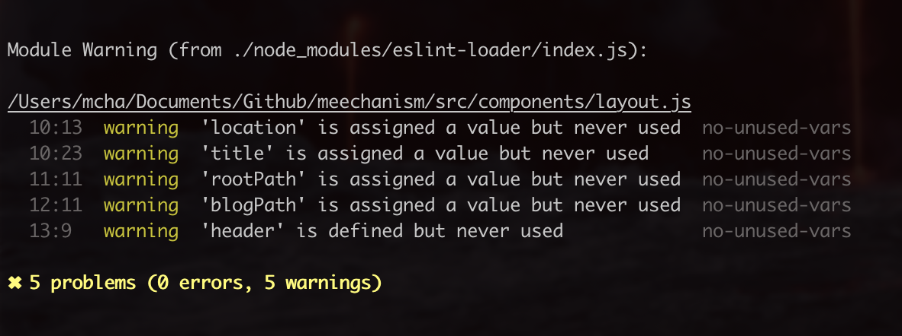

My entrance to the engineering team was a bit non-standard. I joined the organization as a front-end developer on the Customer Experience (CX) team with the hopes of creating and maintaining the component library for engineering to use.

I did that.

<figure>
  
  <figcaption>Screenshot of checkbox component page</figcaption>
</figure>

And then the CX team dissolved and I was pushed into engineering proper. I was okay with this, as it meant I was going to work on actual products and work with a team of other engineers. Very much immediately I found out how much of a mess the organization was regarding how little they knew about front-end development.

To properly organize my thoughts in prep to share with the director of engineering, I outlined and presented my observations as described below.

Yes, I called it "pipeline issues" because the chain of processing requests was a hot mess/non-existent. Yes, I was fed up and made a meeting with people who could do something about this and fix it. The lack of processes, standards, and expectations deeply affected productivity, attitudes, and inter-team relationships.

<figure>
  
  <figcaption>Mee's got 5 problems, and front-end pipeline issues is also one of them.</figcaption>
</figure>

## Front-end Pipeline Issues

I found the following _types_ of issues reoccur and attempted to define them as a stepping stone to help find solutions. The _problems_ section will use these to help determine what type of issue they fall under.

### Types of Problems

- Process: There seems to be a lack of defined and/or standard processes in which all teams follow. If there is a best practice to do something, is it shared across all teams? e.g. Is there a defined process to get from point A to point B?
- Education/training: If someone doesn't know how to do x-thing, is there a resource where they can learn? This can be either a person, documentation, resource or learning platform/service. If it is a person, are we being respectful of his/her time and set up expectations? If it is documentation, is there a maintainer, or is it available via a third party?
- Communication: Are all of the parties involved on the same page in terms of understanding a problem, process, and/or state of x? How long does it take to communicate something (whether simple or complex) across teams to make it effective? (Spoiler alert: usually too long). Are there simple means of getting what you need? Are the specs on a ticket enough to be productive?
- Accountability: Sometimes it is unclear who is in charge, runs expectations, and/or figures out the next steps. This makes it difficult to determine where the source of truth is and can block people from working.
- Tooling: It seems at times individual contributors don't have the correct tools and resources to help them fulfill their tasks. Most times, this can probably be resolved with some education/training.
- Resource: Do teams have the resources they need to be productive and meet deadlines? This can be developer resources, support, design, and everything in between.

<figure>
  
  <figcaption>A relationship is strong when your co-worker can use another's desk for storage</figcaption>
</figure>

### Actual Problems

The following problems list actual examples the team faced. The type of problem is listed after each.

- When and how does a designer review and/or approve dev work? (process)
- Is it acceptable for designers to still go through iterations during developer work? (e.g.: What are the expectations for when things get stable for a release and who is in charge of defining this? Can we get this standardized?) (accountability/process)
- Developers need basic HTML/CSS knowledge and understanding of the box-model (not related to the component library) and grid. (education)
- How does one file bugs/stories for the component library? What are the expectations? Who is in charge of fixing/adding things? (accountability/tooling)
- What are the expectations for debugging components? Should developers all know how to debug their app before pinging the cx-frontend channel? (training)
- Are developers allowed to introduce new UI/styles/states to the products? Who gets to OK the introductions? (accountability/training)
- Why/when does a product have to be designed/built a certain way (eg: login). Who is in charge of communicating this across teams? (accountability/communication)
- What are the standard tools the teams should be using? Is there a standard? Is it needed? Why or why not? If there are already tools, why were they chosen? (tooling)
- Should UI developers be building something before the design and/or stories are fully fleshed/specced out? If so, to what extent and what are the caveats? (process)
- What is the minimum requirement of the specification of the work required for front-end stories? (communication)
- Should the backend APIs/instrumentation layer be built before front-end tasks are worked on? Should there be a process to set up data contracts, even if the APIs don't exist so the front-end doesn't get blocked by data? When does this happen? (process)

## Follow-up

Various leads from different teams came together once a week to align matters, discuss, and resolve any problems. It turns out many issues exist because of the sheer lack of communication.

<figure>
  
  <figcaption>A team working on problems together. Photo by <a href="https://www.pexels.com/@daria">@daria</a></figcaption>
</figure>

If your team is experiencing similar types of issues or problems above, I do recommend getting people together to acknowledge the existence of said problems. Talking is the first step.
