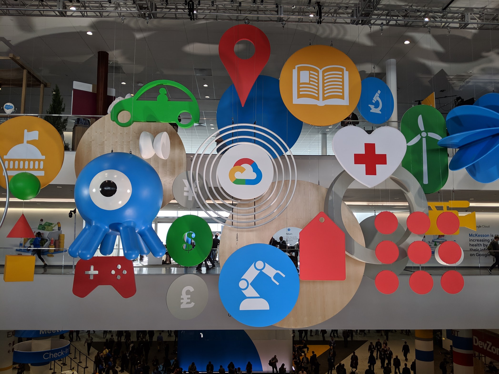
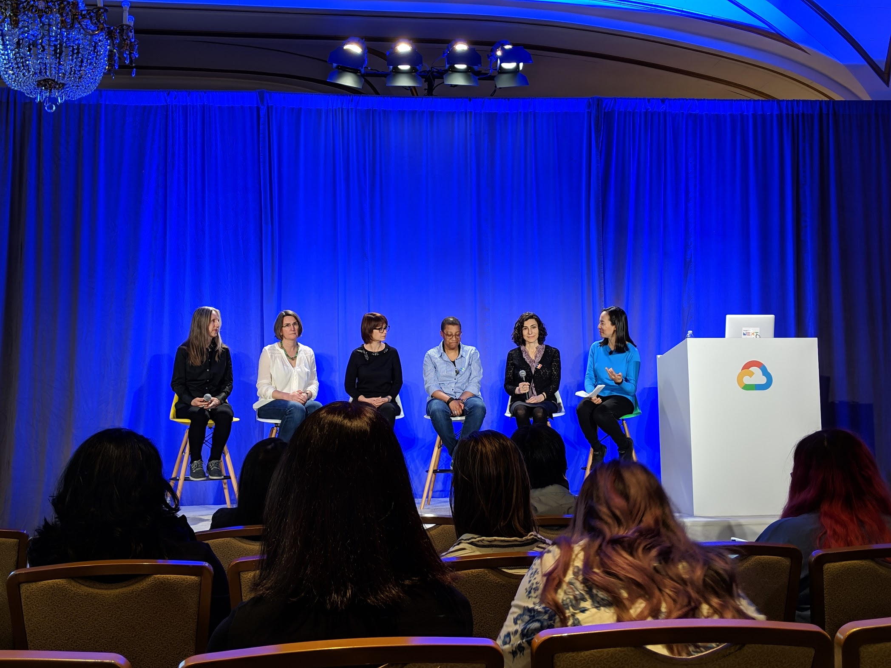
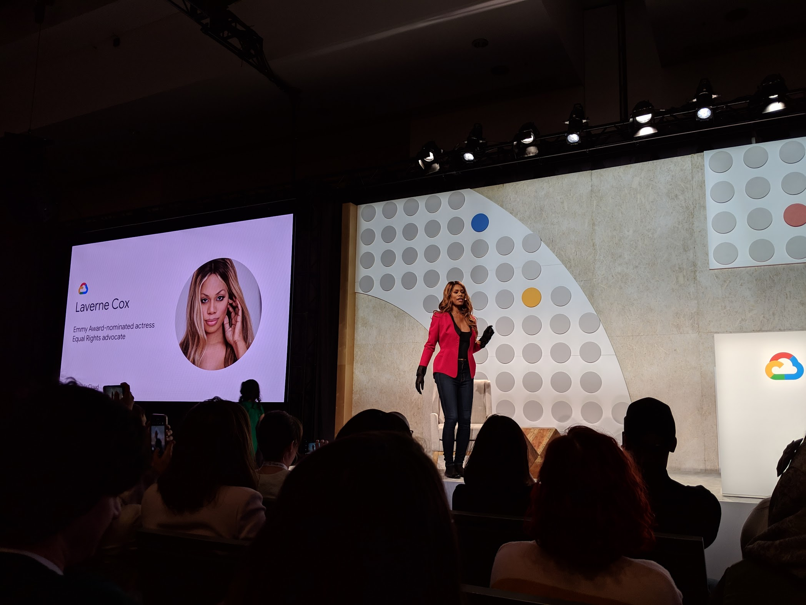
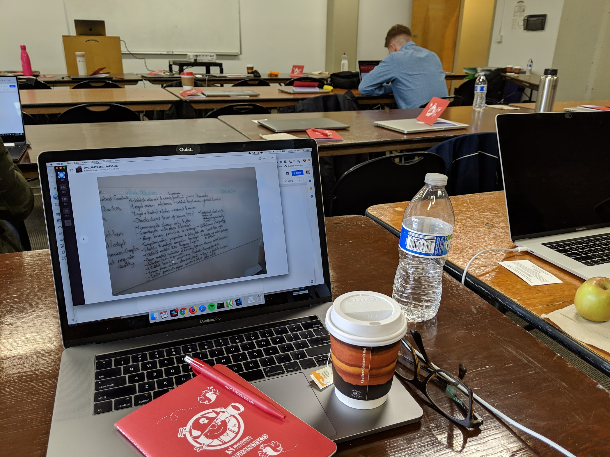
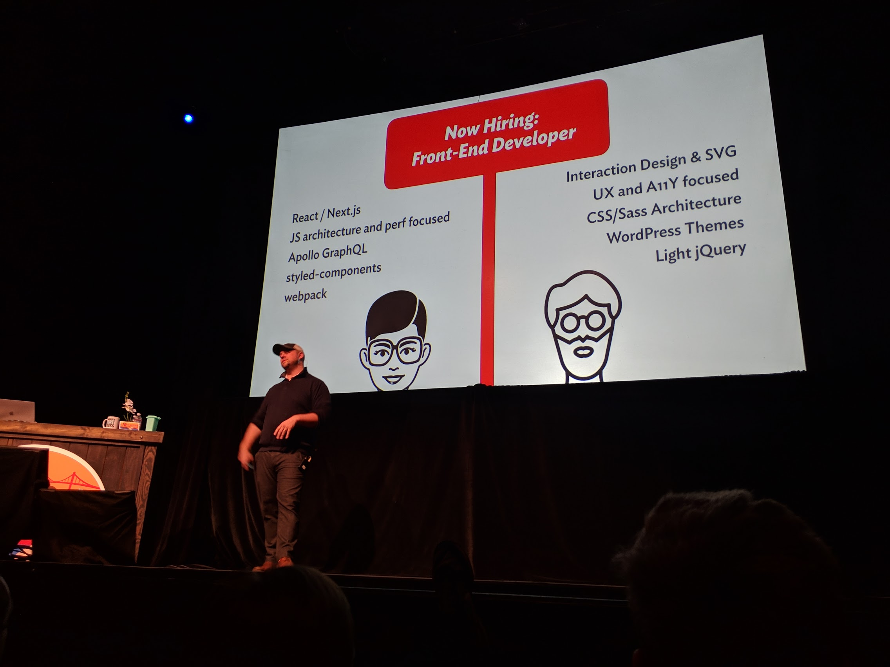
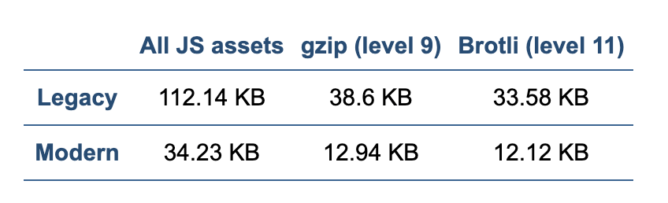
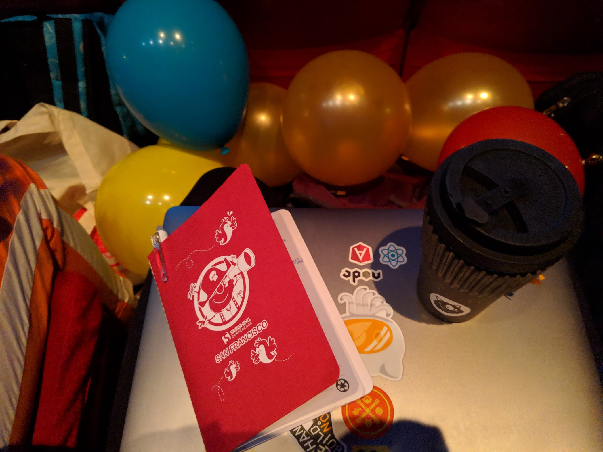

I had the opportunity to attend Google NEXT and SmashingConf SF 2019. Both were in San Francisco, CA and within weeks of each other, so I dub this the Month of Conferences and Learning. Both were multiple days and packed with dense talks.

## Google NEXT (April 9-11)

NEXT is a huge conference held annually by Google to gather entrepreneurs, business leaders, and developers to learn about the future of (Google) cloud and opportunities with the latest technologies. It is multi-track, meaning many sessions run in parallel, so it is smart to plan your schedule and reserve seats to guarantee spots for the things you want to attend.

<figure>
  
  <figcaption>Entrance of Google NEXT hanging decor at Moscone South</figcaption>
</figure>

Many sessions were outside my repertoire, so it wasn’t too difficult for me to create an itinerary without conflicts. I attended sessions related to the Chrome browser, Google App Engine/SPAs/ML, and inclusion/diversity. NEXT is probably one of the most well organized, uncrowded, and well-staffed major events I’ve ever attended. All of the staff was very professional, from the speakers, to the security, to IT, all the way to the kitchen crew, and cleaners who spent time sorting through recycling and compost (because people can’t for the life of themselves seem to know what belongs where and/or don’t care).

### Highlights of NEXT

#### Chrome browser enterprise

- Legacy browser support (chrome m74-beta, stable coming soon)
- (enterprise) Version picking/locking/rolling back
- Password alert
- Search drive from Omnibox
- Tab groups (for those who have tab attachment issues)

#### Business cases for product inclusion

- Case study: the original airbags killed more women than men tested since the model dummies were just men. There was a 40% injury rate for women.
- Case study: designing YouTube for kids. It turns out the text doesn’t mean much to them. Children work better with UIs filled with visuals and speech.
- Warning: Data can be misleading. Phones in India are usually purchased by men but used by women. When using, it’s usually the men’s profile/account being signed into applications. Data already starts with bias and therefore can lead you to make incorrect decisions for products.
- It is important to build a balanced team to create perspective. What missed opportunities and growth are you passing by being exclusive? Who could you/your product be engaging with that you currently aren’t? What can you learn there?
- Pixar reshaped how they created short films by opening up pitches to the general staff. This opened up a breadth of new creative ideas and it was free.

#### Inclusion panel quotes

> "Diversity is a reality, inclusiveness is a choice." - SAP CEO

- People need to overcome their unconscious biases and social stereotypes about certain groups of people that individuals form outside their conscious awareness.
- Practice a prevention program to get feedback.
- Ask why employees are here and why they are staying (as opposed to only doing exit interviews). You can learn a lot about your employees, what’s working well, and insights into what might not.
- Discrimination happens across the board.
- Be proactive within; get feedback from up and down the organization.

<figure>
  
  <figcaption>Women of Cloud (from left to right):
  Christina Storm (UX Manager, Google),
  Michelle Duffy (SRE Director, Google),
  Anna Berenberg (Distinguished Engineer, Google),
  Grace Mollison (Cloud Solutions Architect, Google),
  Ines Envid (Group Product Manager, Google),
  Rae Wang (Group Product Manager, Google)
  </figcaption>
</figure>

#### Building a better mobile web (progressive web app)

- Engaging (UX, hardware, push notifications, creds)
- Installable (add to the home screen, distribute through managed Play)
- Reliable (offline, caching, roughly half of all connections come from 3G, fast (performance optimization, performance budget)
- Case study: Trivalgo, 67% retention after connection loss. Became reliable offline, cached assets, and allowed users to continue to use the site with service workers.

#### Google Contact Center AI and Salesforce Service Cloud Solution

Together, Google and Salesforce built a customer service partnership to create a next-generation Hulu customer service tool. It delivers:

- Live agent assistance: surfaces articles and knowledge documents based on real-time interactions
- Automatic topic determination: help agents quickly resolve issues with AI-powered workflows and provide them with the ability to propose personalized and relevant upsells

A combination of Dialogflow Enterprise Edition dev suite and Salesforce AI platform Einstein together:

- Enables businesses to create natural conversational experiences via intelligent chatbots (understanding capabilities including intent match, entity extraction, sentiment analysis, and live agent handoff)
- Can answer questions and perform common tasks using data already captured
- Support for 20+ languages

#### Laverne Cox (keynote)

<figure>
  
  <figcaption>Lavernce Cox owning her stage.  </figcaption>
</figure>

- I can easily say Laverne’s talk was my FAVORITE thing about the conference, and it felt too short. She is an excellent, well-spoken, highly intelligent, experienced speaker on inclusion, diversity, struggles, and is a strong advocate of LGBTQA rights.

- [Four I's of Oppression](https://www.teacherspayteachers.com/Product/The-Four-Is-of-Oppression-2836212)
  - Ideological (Ideas, eg, “White people are better, trans people are mentally ill)
  - Institutional (public policy, redlining in neighborhoods, gender binary model)
  - Interpersonal (language we use, microaggressions)
  - Internalized (ex: when marginalized people think they are less than others)

> "We are a culture adverse to vulnerability" - Laverne Cox

- Community resiliency model: establish a stable zone and skills for self-care and to share with your community. It teaches you how to balance a nervous system impacted by personal or community-level trauma (such as violence, poverty, racism, and homophobia).

> "Empathy is the antidote to shame." - Laverne Cox

- Studies show that speaking to another person out of empathy will cause shame to dissipate by 85%. However, we need to build safe spaces to do this.

> "Privilege means you don't have to think about stuff." - Laverne Cox

- Privilege is highly dependent on the room you are in (eg: context).
  - Try talking less if you have privilege.
  - If you do not have privilege, speak up.

#### Other small things

- Google Hangouts live auto transcription
- Autodesk ported over Autocad to Web Assembly, can use on the web.

Overall, I was a little disappointed with the quality of the inclusion and diversity panels. They were very shallow and only scratched the surface of the issues we see. Everyone agreed there is a lack of diversity and inclusion within tech in general and it can be better, but none shared solutions or plans, and only provided the beginnings of conversations. I guess that is better than nothing?

I was hoping to see these bigger companies show some kind of initiative on a larger scale since they work at companies that (seem) to have the resources to do so, and (may) be in positions to do something about it.

Laverne’s talk by itself stood out as an excellent example the conference should follow. She provided statistics, facts, experience, relatable content with solid stories, and examples of what she has done to make lives better for the community.

---

## SmashingConf SF (April 15-17)

SmashingConf is held annually in San Francisco (and other parts of the world)
by [Smashing Magazine](https://www.smashingmagazine.com/). I think this editorial is the oldest one I’ve been following since the early days of my career, yet this is my first time attending.

### Workshop

Note that there was an option to attend some workshops on days before/after the conference. I opted in to attend Vitaly’s _New Front-End Adventures_. Space for it was a bit cramped and the screen for the projector could have been bigger, but I learned a lot of things. Vitaly had a TON of material and asked the group what we wanted to focus on now and then, so it was a fluid class.

<figure>
  
  <figcaption>My setup at the workshop</figcaption>
</figure>

They did provide ample time before, during, and after to get free snacks, coffee/tea, lunch, and bathroom breaks. There were also plenty of power outlets for your laptop.

### The conference itself

This is a much smaller and intimate single-track conference consisting of mostly only designers and front-end engineers. Most talks were filled with UI/UX content (very up my alley), with a mixture of technical and non-technical sessions.

One fun bit: every goodie bag you got during badge pickup had a balloon. As a part of the opening ceremony, the audience blew up their balloons and threw them up in celebration. It was very exciting and a great way to start the day, full of energy and a sense of community.

<figure>
  
  <figcaption>Celebratory balloons</figcaption>
</figure>

Most were insightful, especially the accessibility ones. There was only one talk that was catered to more non-technical folk (eg, the designers in the house) and the topic was demystifying GIT. I use GIT on a day-to-day basis, but I could see how useful it was for non-technical people to understand what GIT is used for, how it is useful, and most importantly, why it is not magic and how it is fairly simple once you break it down. Take away: do not be afraid of tools and learn their benefits!

### Highlights of SmashingConf

Note: most of these were gathered from the workshop as I had a digital copy of these. I started writing notes (WITH A PEN) in my little red booklet for the single-track conference and did not transcribe those. They shall be lost forever.

#### Compression

- [Brotli](https://github.com/google/brotli): A data format specification for data streams compressed with a specific combination of the general-purpose LZ77 lossless compression algorithm, Huffman coding, and 2nd order context modeling.

  - [Brotli vs Gzip Compression. How we improved our latency by 37%](https://medium.com/oyotech/how-brotli-compression-gave-us-37-latency-improvement-14d41e50fee4)
  - Browser support built into natively (future compatible).
  - Lossless and compression and decompression.
  - Significantly slower at compressing, but provides a better ratio to savings than gzip
  - Ideal for serving static text-based content (CSS, HTML, js, SVG).
  - An advantage for large files
  - Decompression is fast, comparable to Zlib
  - Served only through https

- [Lepton](https://github.com/dropbox/lepton): A tool and file format for losslessly compressing JPEGs by an average of 22% by predicting coefficients in JPEG blocks and feeding those predictions as context into an arithmetic coder.

#### Image Tricks

Get the compression of a JPEG with the transparency of a PNG.

- [Sapporo Case Study](https://peterhrynkow.com/how-to-compress-a-png-like-a-jpeg/)

#### What is a front-end developer anyways?

Don’t worry, it turns out a lot of us are stuck in the boat of being a unicorn that has to keep up with way too much new stuff and employers wanting too much from us.

<figure>
  
  <figcaption>Chris Coyier asking what defines a front-end developer</figcaption>
</figure>

It may be time to distinguish the differences between the different types of
front-end developers out there.

- Are you more developy?
- More designy?
- Do you do more of the back of the front-end?
- Do you do the front of the front-end?

#### Email

- Litmus: build, test, and analyze email campaigns
  - [Email images and defensive design](https://litmus.com/blog/email-pixel-art-the-rarest-and-coolest-defensive-design-tactic)
  - Lots of crazy highly interactive stuff you can do with punch-card like state management with radio+checked pseudo-class in CSS
  - [Interactive email with accordions](https://litmus.com/builder/86117f8)
- [Gamification](https://email.trendyminds.com/t/ViewEmail/d/1B18DB24A3E233E3/4006C484FAE38D46EBAD456BEB5F1DD6)
- [Zurb Ink](https://zurb.com/ink/): a responsive email framework

#### Performance

- [Differential Loading w/ Jeremy Wagner](https://calendar.perfplanet.com/2018/doing-differential-serving-in-2019/): Deliver different bundles based on browser capability. We target based on babel config to support legacy browsers and then shave off bundles for modern browsers (remove unneeded polyfills)

<figure>
  
  <figcaption>Differential loading before and after statistics</figcaption>
</figure>

#### Typography

Dynamic Web Typography: [FF Meta Variable Font Demo](https://codepen.io/jpamental/full/MGEPEL)

Variable fonts are an evolution of the OpenType font specification. It enables many different variations of a typeface to be incorporated into a single file, rather than having a separate font file for every width, weight, or style. They let you access all the variations contained in a given font file via CSS and a single @font-face reference.

- Previously: 'Roboto Regular', 'Roboto Bold', and 'Roboto Bold Italic'
- Now: All permutations can be contained in a single file

- [MDN Guide + interactive examples](https://developer.mozilla.org/en-US/docs/Web/CSS/CSS_Fonts/Variable_Fonts_Guide)

<figure>
  
  <figcaption>Variable webfont example</figcaption>
</figure>

#### Other Tricks/Things

- [SVG Trace placeholder]([https://codepen.io/ainalem/full/aLKxjm/)
- [Can I stop using IE11?]([https://canistop.net/)
- [Glenn's goofy optimization(?) of html class names](https://glenmaddern.com/) (view the source)

<figure>
  
  <figcaption>All my smashing notes, surrounded by balloons</figcaption>
</figure>

If you are a front-end engineer (or work full-stack) or are a designer, or interested
in UI/UX, I cannot recommend SmashingConf highly enough.
