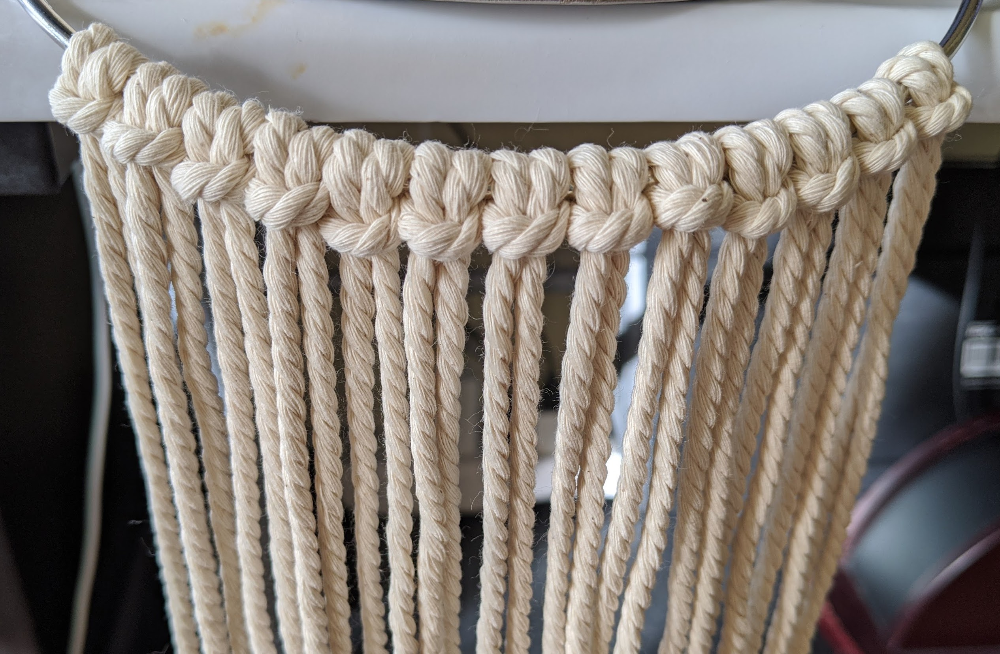
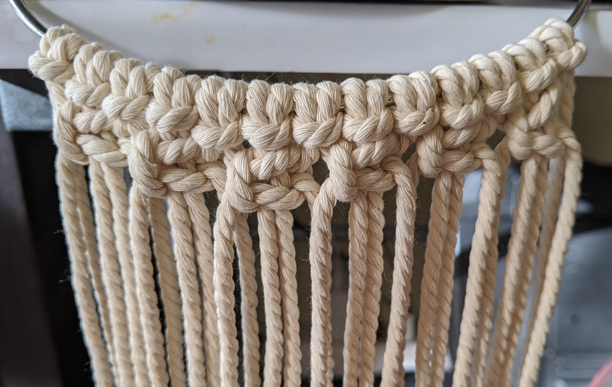
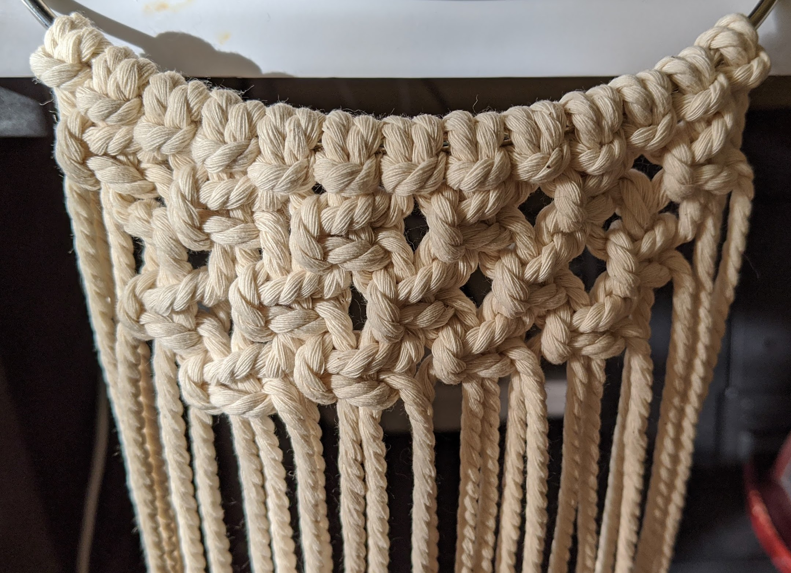
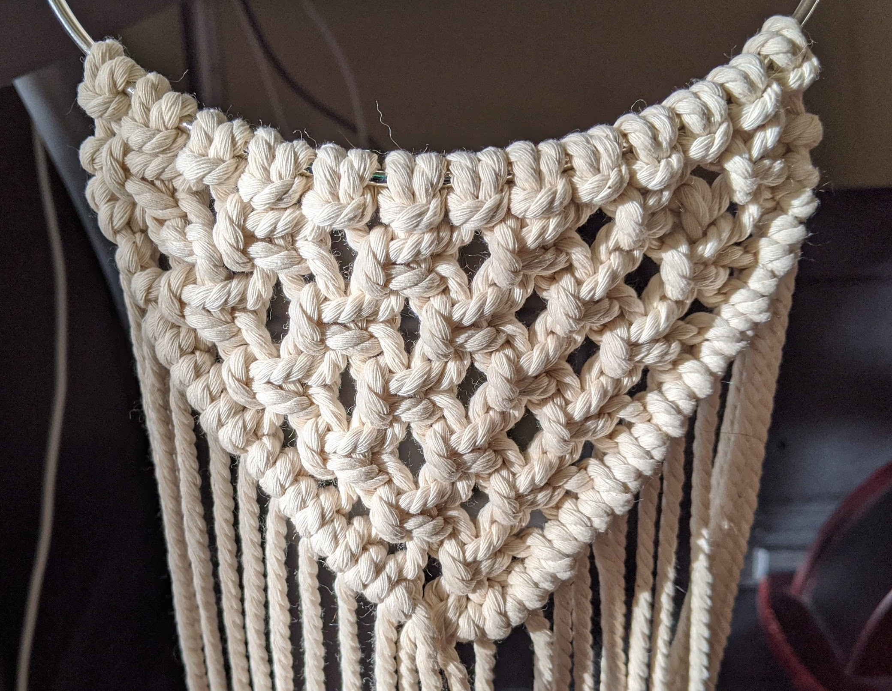
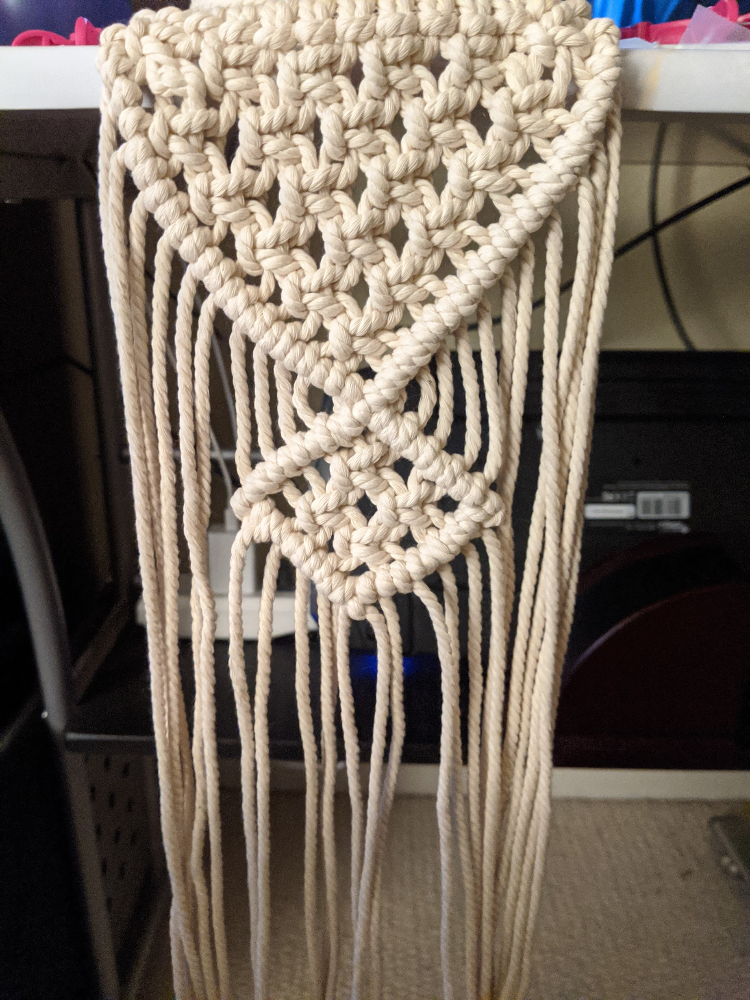
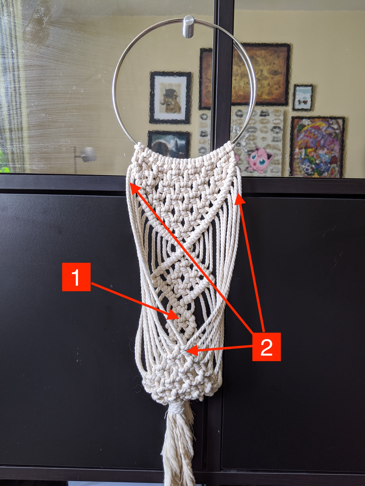
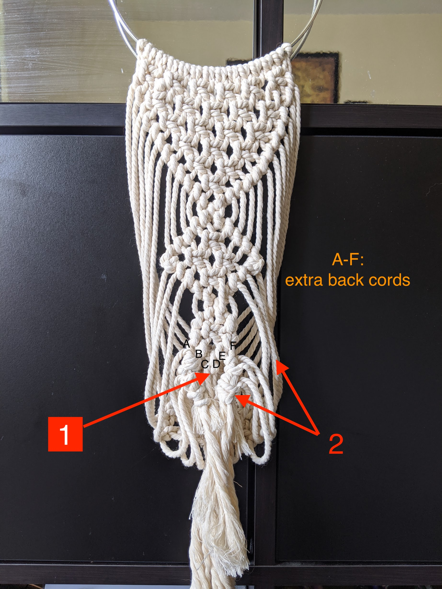
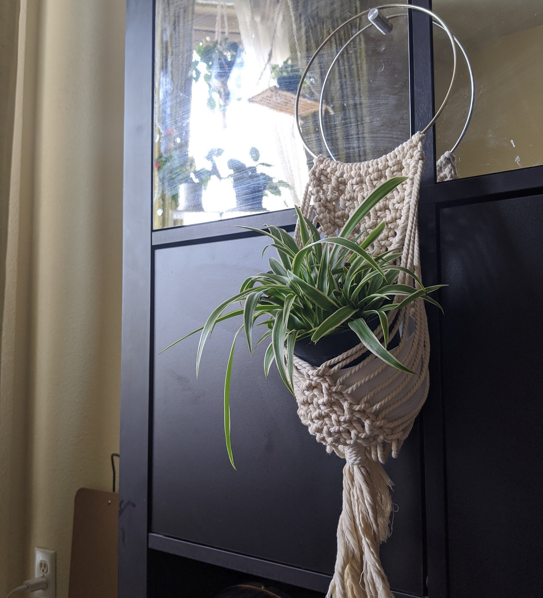

### Knots

Notes on knots you will use:

- lark's head
- square
- clove hitch
- gather/wrapping

### Materials

- Used a 16cm diameter ring as my support
- Measured out 13 strands of 159cm (yes, and odd number of cords!)

### Step 1:

Loop all cords with Lark's Head Knot to ring

### Step 2:

We want to create a V-shape with square knots. To start:

- Skip far left (first) and far right (last) cords.
- Make square knots (4 cords) for one entire row.

### Step 3:

Continue to square knot more rows:

- For every new row, skip the first and last additional TWO cords.
- Ex for second row: skip outer left (first THREE) and right most (last THREE)
- Continue until you complete a triangle of square knots.

### Step 4:

Run diagonal clove hitch knot sennits along the side and to the bottom of the triangle.

### Step 5:

Make the top left and right border of clove hitch knots with the inner five cords.
Fill the inside of the diamind and create the lower clove hitch knot border.

### Step 6:

Sorry, I failed to take photos of the rest because it happened the next day:

1. I made another smaller triangle square knot surrounded by a small series of hitch knots
1. Brought outer 4 cords from top left and right to create the first square knot at the front of the basket. Twisted it once INWARD to create the basket holding look.
1. Make FIVE rows of square knots.

### Step 7:

Here is the backside. There was no plan or rhyme or reason for this. It is messy because the cords used for the square knots started to get short. ;) It looks like a saggy diaper. Many regrets that I didn't have a pot sitting in this while I made the bottom.

1. You should have 6 cords back here. Tie the middle two cords (C and D) for extra strength.
1. Tie the excess cords from the bottom of the front part of the basket around the outer two cords (AB and EF).
1. Gather all the cords and create a gather/wrapping knot.

### Result

This should fit a 10-15cm (4-6in) planter with a small plant nicely. The top most lark knot to the gather knot is around 25cm (9.8in). This was my very second macrame project ever and I found out it's good to have a plan!

I placed a 11cm (4.3in) diameter cut yogurt plastic tub in the macrame hanging basket and put in a 10cm (4in) spider plant in it. The plastic is lightweight and acts as a water basin for any plant inside.

I found these basket hangers to look best hanging against a wall/flat surface as opposed to being suspended from a ceiling hook.
