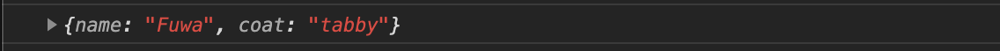
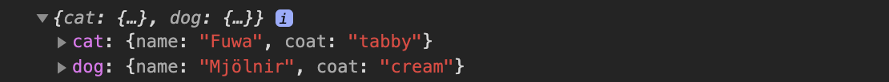
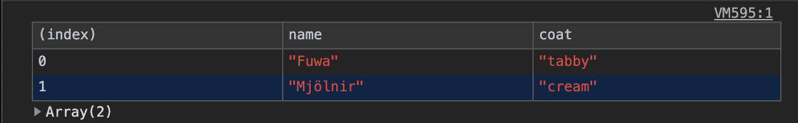

I admit it; I sometimes get into a bind debugging some of my JavaScript. Something that helps me climb out of my hole is the ability to see the values assigned to some variables. This helps provide context around the problem area and what may be happening. A straightforward way to do this is to use the JS _console_.

There are several ways to log, some better than others.

## Tip 1: Object dump

Simply dumping the object can be useful if you want to be able to expand and see all values.

```js
const cat = {
  name: "Fuwa",
  coat: "tabby",
}
console.log(cat)
```



But once you have multiple objects, it can be burdensome because you don't know the name of the variables once they are logged.
This might be relevant information useful for your debugging.

```js
const dog = {
  name: "Mjölnir",
  coat: "cream",
}

console.log(cat, dog)
```


We can easily resolve this with very little code footprint by using ES6's _property value shorthand_. In short (pun intended), it allows us to abbreviate the initialization of a property within an object literal with the variable's name.

```js
console.log({ cat, dog })
```



## Tip 2: table log

If your objects contain the same properties, it might be helpful to see all their values in one go. You can use
the `console.table` method by passing in your list of objects.

```js
console.table([cat, dog])
```



## Tip 3: template literals

If you find it easier to digest your values by adding some English language, you can `console.log` your string:

```js
console.log(
  "The cat's name is " + cat.name + " and the coat is " + cat.coat + "."
)
```


This is an older verbose way of piecing together a string with variable values and it requires space management.

Template literals allow us to build our string with embedded expressions. By using backticks to indicate the start and end of a template literal,
we can provide placeholders with an `${expression}`. Here is the equivalent template literal example for
producing the same output.

```js
console.log(`The cat's name is ${cat.name} and the coat is ${cat.coat}.`)
```

If you have any other useful ES6 JS console tips, shoot me a message!
