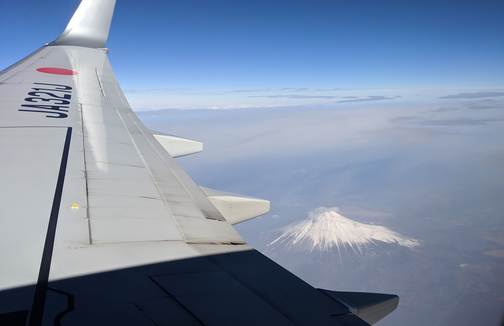
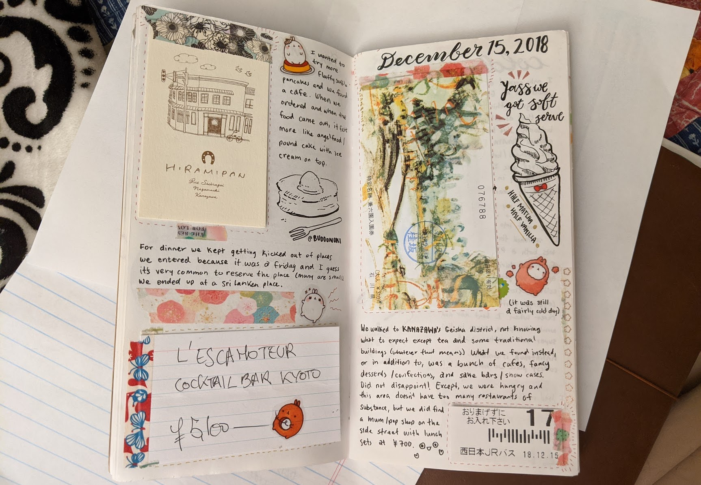
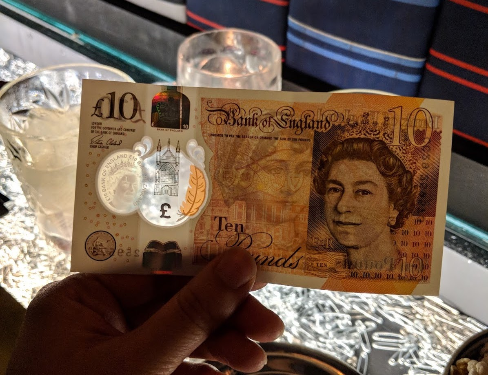
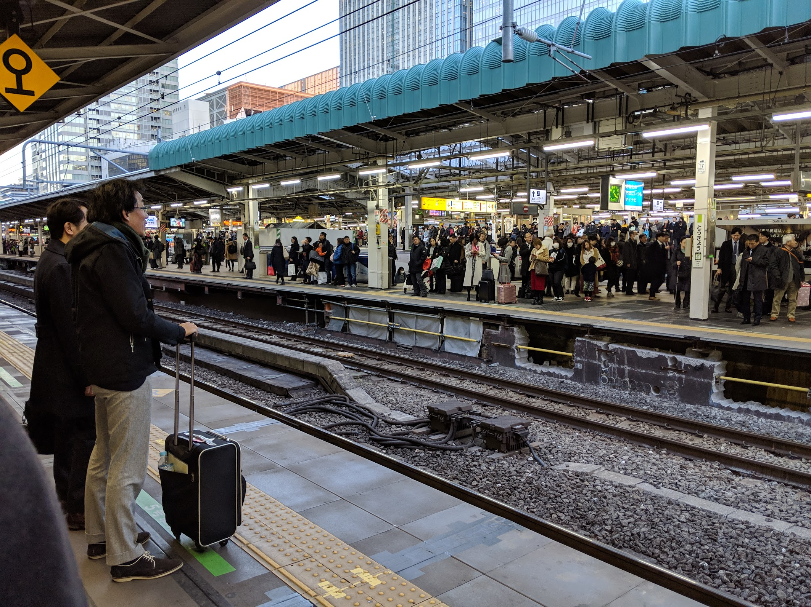
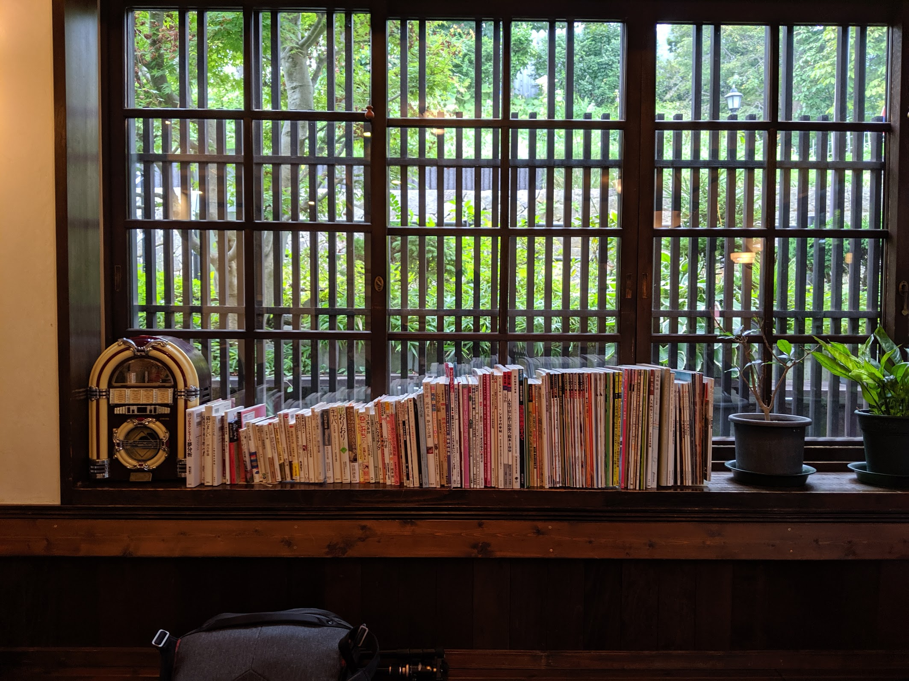

<figure>
  
  <figcaption>Flying over Mt. Fuji, Japan, Dec 3, 2018</figcaption>
</figure>

I've had my fair share of domestic and international travels. I wouldn't say I'm seasoned, but I do find I have a pretty good grasp on some essentials required to make me feel confident about my planning.

I've learned over time there IS such a thing as overplanning! A downside is not allowing enough air to breathe in between todos and getting exhausted or stressed out. This can cause frustration and tension if there are multiple people involved.

But this list should build you to a healthy foundation for your trip.

## #0 Research

Get yourself a list of places (countries, regions, cities, landmarks, heck, even local cats or dogs) you want to visit. This will help out with the next step.

<figure>
  
  <figcaption>Researched ahead of time to visit Kanazawa and still surprised at the amount of amazing local offerings. Dec 15, 2018</figcaption>
</figure>

If you are traveling internationally, make sure your passport is valid for when you will be traveling.

If you don't yet have a passport and plan to travel abroad, you can [expedite the passport process](https://travel.state.gov/content/travel/en/passports/get-fast.html) under certain conditions.

## #1 (Soft) Budget

It might difficult earlier on to figure out how much you are willing to spend, but this step will help you determine whether or not a trip is viable. For me, I have a hard cap on how much I'm willing to spend to go to X-country during Y-time of the year. I'd most likely say HELL NO for roundtrip tickets to Japan (from California, USA) anywhere north of USD 1,000. You can find much better deals!

Knowing your budget can also help you determine when in the year to go. For example, tickets are generally cheaper to go to Hawaii during the spring since it is their offseason.

## #2 Plan Milestones

What are milestones? These are the BIG things. The things that will make you miserable if planned poorly or the thing that you WANT to do might be what inspired the trip.

<figure>
  
  <figcaption>Travel journal of Japan. Jun 7, 2016</figcaption>
</figure>

Examples:

- Book Lodging/Stay: Check out local hotels, bed and breakfasts (eat grandma's decadent meals), hostels for those on a budget (and meet amazing people from around the world), or even couch surfing, etc
- Dining: If there was a restaurant you wanted to try, I recommend making a reservation as soon as possible
- Museums: See if you can get advanced tickets so you can skip the line.
- Events: Purchase ahead of time if possible. Some events hike up the prices at the gate. Also, some have time slots, so purchase one that works for you and plan around it ahead of time.
- Historical monuments, parks, sites: Again, check to see if there are timing and people limitations and if you can purchase tickets ahead of time if it is competitive.
- Experiences: Various services allow you to book "experiences" (e.g.: Airbnb) with local experts. These usually require planning and booking ahead of time.

Don't get too carried away here. I'd say lodging/stay is required, but the others are nice things to have for excitement.

<figure>
  
  <figcaption>Walking up through Himeji Castle. One of the castles I dreamed of visiting as a child. Dec 18, 2018</figcaption>
</figure>

> Note: Only officialize this part after purchasing your plane ticket. It makes no sense to do it before you know you're officially going. However, it may make sense for you to see a soft-list of milestones to help you determine whether or not to purchase your tickets. For example, maybe the concert or hotel you wanted to stay at is completely booked.

## #3 Notify your banks

Any credit or debit cards you plan to use to pull money or make payments should be cleared with your banks for travel. Some banks don't require this (Bank of America), but some still require you to make a manual notice (like Chase).

You can usually do this on their online portals and select which dates you plan to travel to. I usually do this the week before I fly out.

## #4 Currency Exchange

There are a couple of important notes here:

- Determine if the area you are visiting is a cash-economy (meaning most places accept cash). Japan, for example, is a cash economy. A lot of places in very urban areas like Tokyo and Kyoto will accept credit cards, but as soon as you go out into the suburban or rural areas (highly recommend), then you will start seeing that cash is required.
- See if it makes more sense to exchange domestically or internationally. You might be able to save some money.

<figure>
  
  <figcaption>Me amused by the see-through pound, London, UK, Dec 22, 2017</figcaption>
</figure>

## #5 Phone service/data

Some people like to disconnect when traveling. Not me. I like to be alive and know where I am going. I mainly use this for maps, pick up local transit information, and to determine what I should do next.

Depending on where you are going and your requirements, check to see your best options for receiving service and data. Popular options:

- Local sim cards: You can usually purchase these for cheap at the airport or convenience stores. Many European travels use this option. Also, check to see if your device will work on those networks.
- Pocket-Wifi: If you only need data and/or you can make wifi calls/texts, this might also be a good fit. It is best to reserve one online for the duration of your stay, pick up at the airport, and drop off at the airport when you are ready to return. I find this is best for Asian travels (Japan, Taiwan, Hong Kong)

## #6 Transportation

It's scary getting around a new place! To decrease any anxiety, familiarize yourself with local public transit systems offerings (buses, local/bullet trains, subways, ferries, taxis, rideshares, etc) and payment methods.

<figure>
  
  <figcaption>Busy Tokyo station train platform. Dec 19, 2018</figcaption>
</figure>

Good questions to ask yourself:

- Is there a prepaid/loadable transport card you can purchase? If so, do you know where you can get one and the verbiage used to load it? (e.g.: Clipper in the California Bay Area, IC Smartcards in Japan, and EasyCard in Taipei)
- Are there deeply discounted offerings for traveling tourists? (e.g.: Japan Rail Pass). If so, do you need to purchase it ahead of time?
- Are there local rideshares available? Do you have the apps installed? (e.g.: Lyft, Uber, Juno, Grab)
- Which methods of transport are more cost-effective for your travel?

<figure>
  
  <figcaption>We took a tour bus through the Scottish Highlands and never expected to have our breaths taken away. Dec 7, 2017</figcaption>
</figure>

---

## Conclusion

Again, I stress that overplanning can cause anxiety especially because unforeseen issues can pop up (delays, bad weather, cancellations, etc). The more things you have planned, the less amount of flexibility you have. But, ensuring you have the essentials is key to feeling relaxed about a looser schedule.

<figure>
  
  <figcaption>Relaxing during the rain at cafe Motomachi Saryo 元町茶寮, Hakodate, Hokkaido, Japan, Sept 6, 2019</figcaption>
</figure>

When all else fails, just remember the only two things you need are your passport and money. Those should be able to get you somewhere safe.
