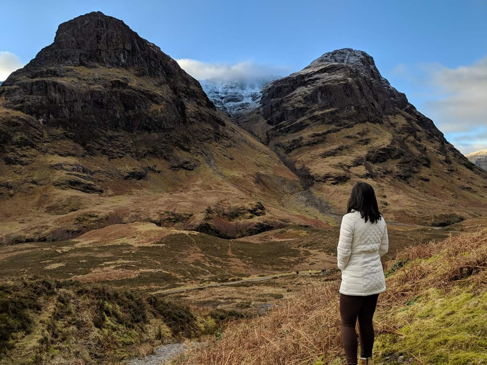

I have a trip planned to explore more of the Scottish Highlands next year (2020). I've been itching to return
because my last trip was only several days, but I fell in love.

<figure>
  
  <figcaption>Me admiring the beauty of Glencoe, Dec 2017</figcaption>
</figure>

Ever since my last trip in Dec 2017,
I've come to appreciate and embrace the wealth of knowledge the locals provide. I used to have a bad attitude about
tourism as it can cause congestion and cripple communities and the environment, so I'm expanding my travels with
[eco-tourism](https://en.wikipedia.org/wiki/Ecotourism) in mind.

As I was searching for some experiences or places to visit, I landed on two terms unfamiliar to me:

- _Crofting_: a form of land tenure and small-scale food production particular to the Scottish Highlands, the islands of Scotland, and formerly on the Isle of Man.
- _Gillie_: (in Scotland) a man or boy who attends someone on a hunting or fishing expedition.

I found a Scottish family croft that will provide a traditional dinner. I will also get to walk around the land, hopefully learning some more about crofting and this family's multi-generational story.

There was another experience I found at a hunting village where I could be taken out to forage some yummies: wild garlic and mushrooms. The website for this location said I would have to contact the _gillie_ onsite to see what is in season and how the weather is before going out.

I love learning new terms from different cultures, as I feel a lot of these trades are lost.
