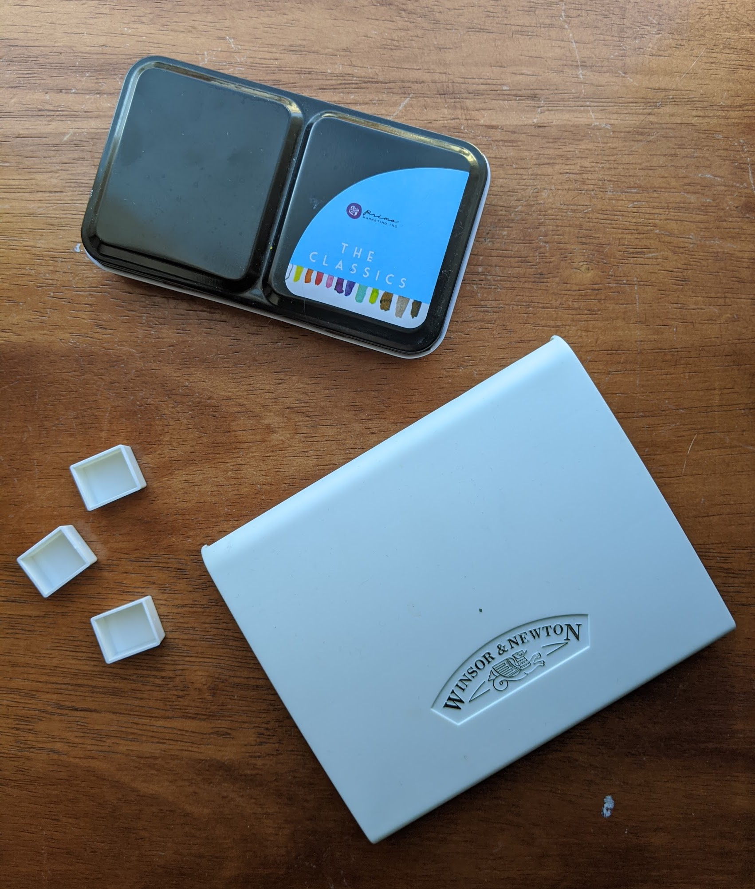
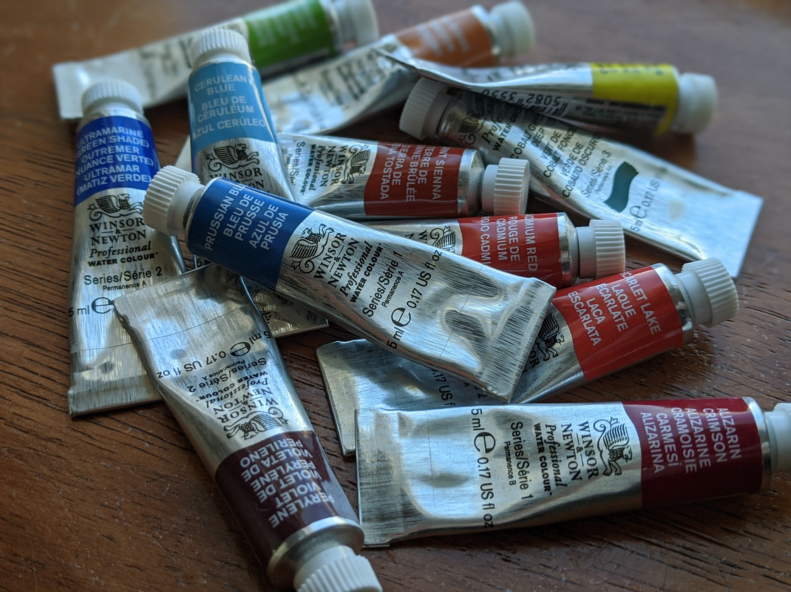
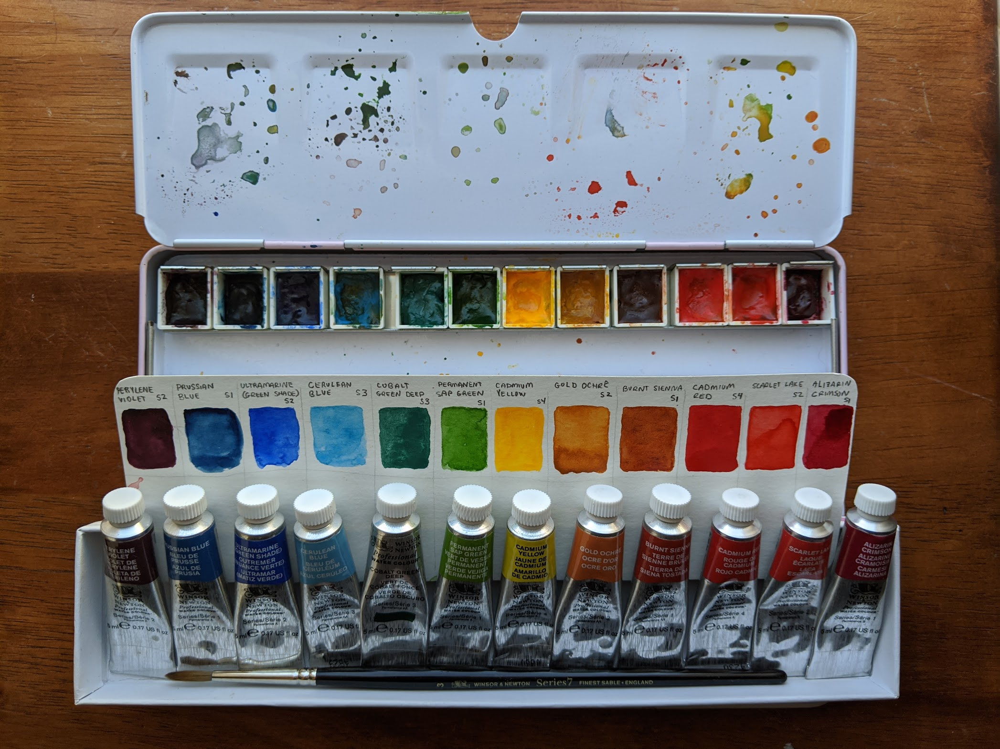
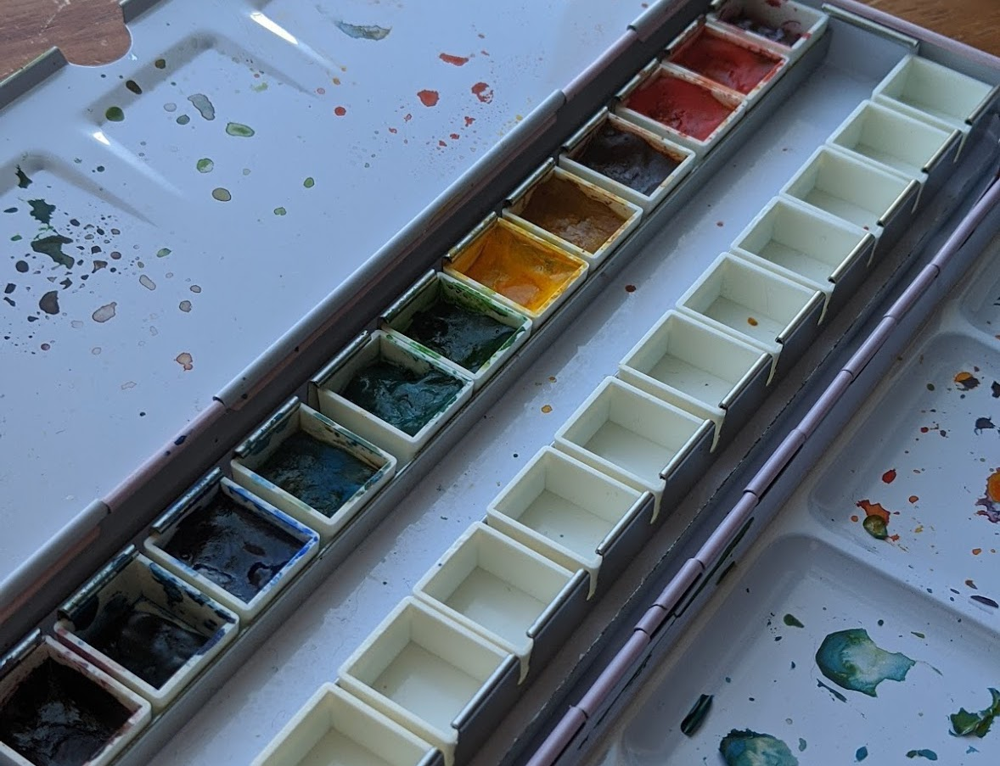

Those little premade watercolor palettes were nice and economical, useful for starting
my watercolor journey, testing which hues match my style, excellent for travel,
and let's not kid around, they are super cute. :D More practically, I don't
have a studio or permanent workspace at home, so I like the format of a watercolor tin.

However, there came a point when they didn't have the colors I wanted.

I found myself popping out two or more palettes just so I could use several colors
from each, and did some swapping. I also didn't have a good range of colors to let
alone use, but mix. It was just a bit frustrating. I realized maybe what
I needed was a generic palette filled with colors I most often use and are versatile enough to mix new colors.

_Note that compact palettes aren't the only ways of using watercolor. Some artists prefer
to use paint straight from the tube onto a separate palette, which gives the paint an already
wet consistency. Others, like me, prefer to use dried pies. Whichever works best
for you, this article may still help you find some excellent colors for your toolkit._

I explored some of my favorite watercolor artists' go-to colors and read a bit on
what colors would make a good beginner's palette. I made a list and purchased
my first set of watercolor tubes though [Blick](https://www.dickblick.com/).

The final list consists of [Winsor & Newton Professional Watercolor Tubes](https://www.dickblick.com/products/winsor-and-newton-professional-watercolor-tubes/),
but note I'm no brand loyalist (at this point). Pick brands that meet your
criteria and fit your budget! Also, note that brands may use the same color name,
but may have a different pigment recipe (e.g.,: the colors will look slightly different!)
Look on the back of the tubes or read the details from the manufacturer's website
if you want to compare.

The following were my choices for my first palette. I got 12 tubes of 5 ml each
and they all vary in price (~ \$5-9 USD) depending on the pigment.

|                                                                                                                                        |                                                                                                                                            |
| -------------------------------------------------------------------------------------------------------------------------------------- | ------------------------------------------------------------------------------------------------------------------------------------------ |
| Alizarin Crimson PR83            | Cerulean Blue PB35                 |
| Cadmium Red PR108                | Ultramarine Blue (Green Shade) PB29 |
| Scarlet Lake PR188                | Prussian Blue PB27                    |
| Cadmium Yellow PY35             | Perylene Violet PV29                  |
| Cobalt Green PG50              | Burnt Sienna PR101                  |
| Permanent Sap Green PG36 + PY110 | Gold Ochre PY42                    |

> Fun fact: The most expensive was cadmium red at \$8.81 USD

I thought the above was a good start, but the more I read and looked at palette guides,
I found I would make the following changes:

- Use full pans instead of half-pans. The half pans make it difficult to pick up pigment with larger brushes.
- Add Quinacridone Magenta or Permanent Rose

Here is what the filled in pans, swatches, and tubes look like.

I purchased this [24 pan watercolor tin](https://www.amazon.com/gp/product/B01N5GR1DH/ref=pe_2640190_232748420_pd_te_o_s_ti?_encoding=UTF8&pd_rd_i=B01N5GR1DH&pd_rd_r=1XB69221SWS1WFTR79NC&pd_rd_w=Dh94n&pd_rd_wg=67WgG&pf_rd_p=9818265f-dee1-4bdd-a5cc-609c09e2865a&pf_rd_r=1XB69221SWS1WFTR79NC) from Amazon.
When browsing, the reviews varied far and wide, and since this was on the cheaper
end, I didn't really have high expectations. It is a cute pastel pink and the
brand has part of my name in it. :B The lid doesn't close evenly, so one corner
if always poking a bit higher, but I'm okay with that for the price. This tin
came with 24 pans, but as you can see in the photo, I only have half of it
filled at this moment.

Extra resources I found useful for referenceing more palettes and watercolor properties:

- [B. MacEvoy - A basic palette](http://www.handprint.com/HP/WCL/palette5.html)
- [J. Blundell - Building your own palette of colours](https://www.janeblundellart.com/building-your-palette-of-colours.html)
