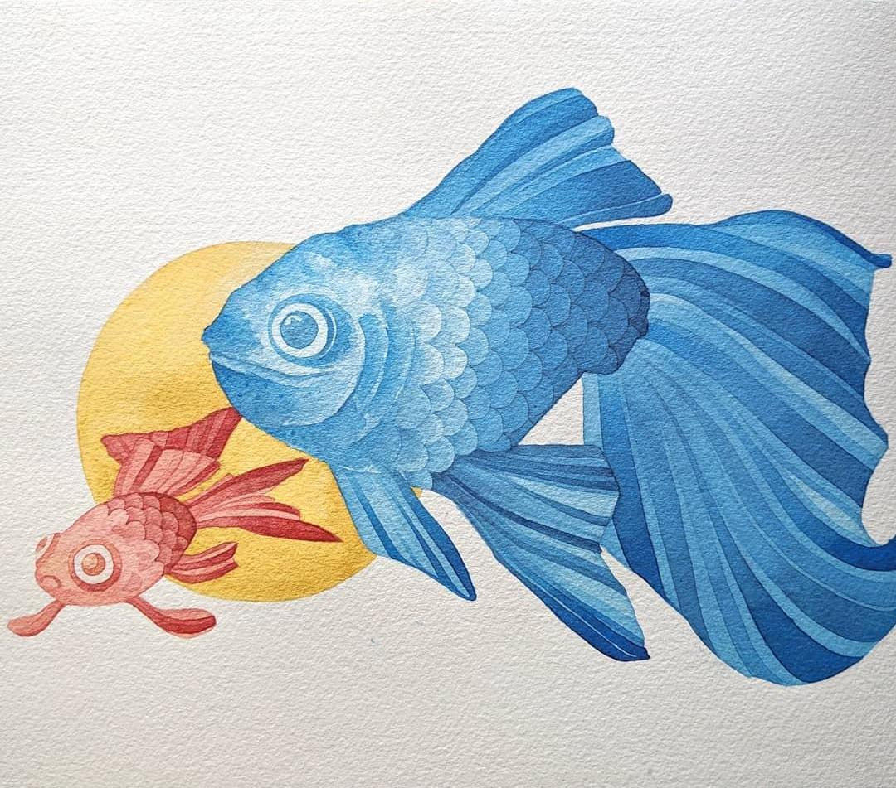
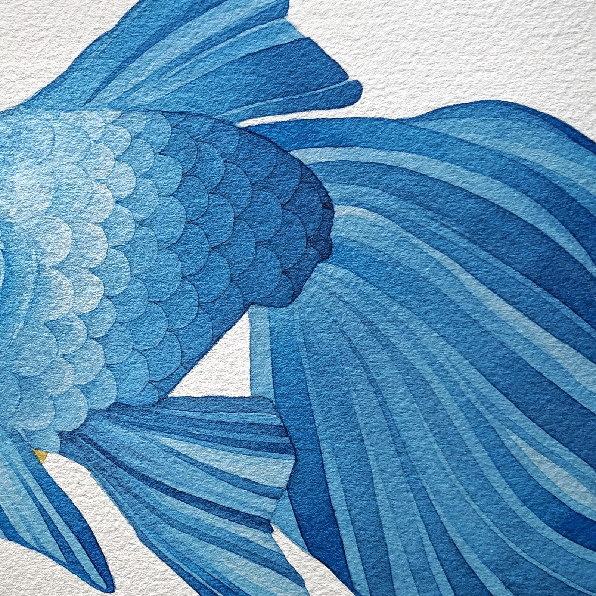

Inspired by the scales of [Ashley's](https://ashleyprejolesart.com/) bookmark class exercise, I decided to try out my own negative painting.

- **Paper**: St. Cuthberts Mill Saunders Waterford series
- **Water Color**: Winsor and Newton
- **Brushes**: Round 10 and Round 6

<figure>
  
  <figcaption>Negative watercolor painting of fish</figcaption>
</figure>

Here is a close up shot of the scales and gradients on the tail of the larger fish. I was pretty happy with the gradients of the tail. The value change sort of got dramatic with the scales though, hehe.

<figure>
  
  <figcaption>Negative watercolor painting of fish</figcaption>
</figure>

Overall, this was a great exercise and I learned a lot from Ashley's class. Definitely 100% recommend watching all of the videos in this class. Every exercise was informative and well explained. I also enjoyed being able to come and go from
this piece while running around throughout the day.
