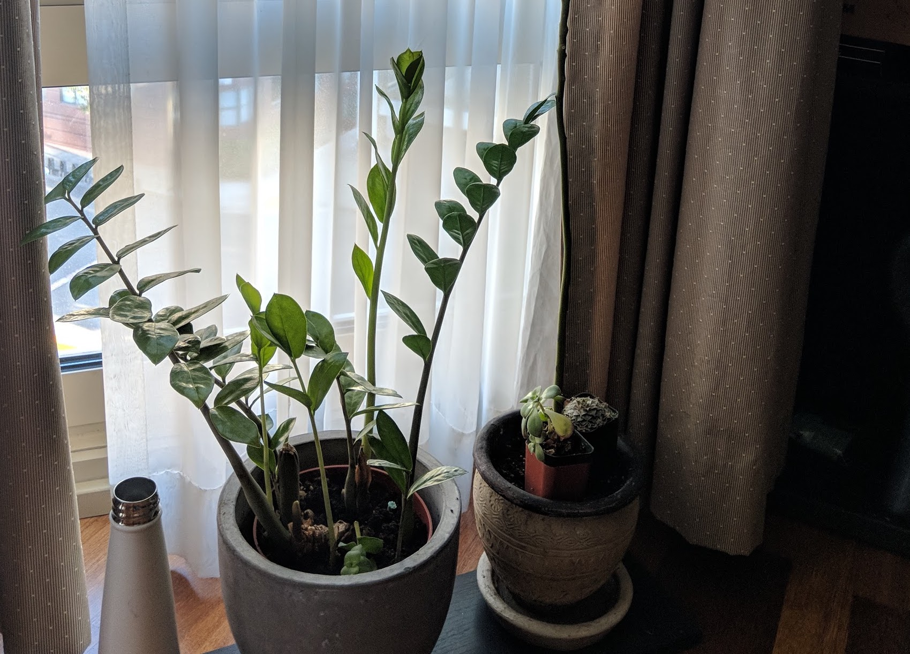
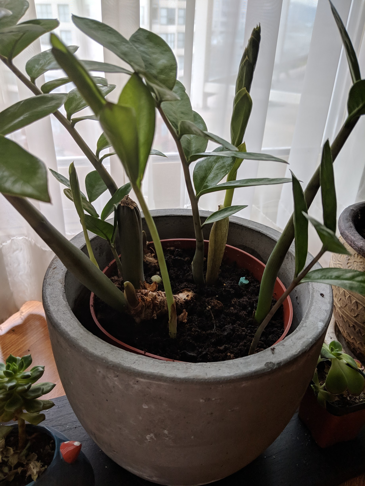
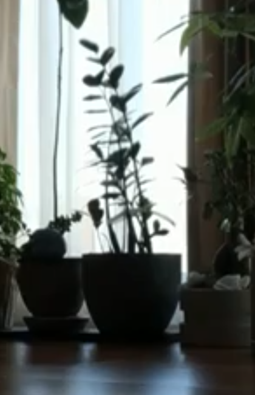
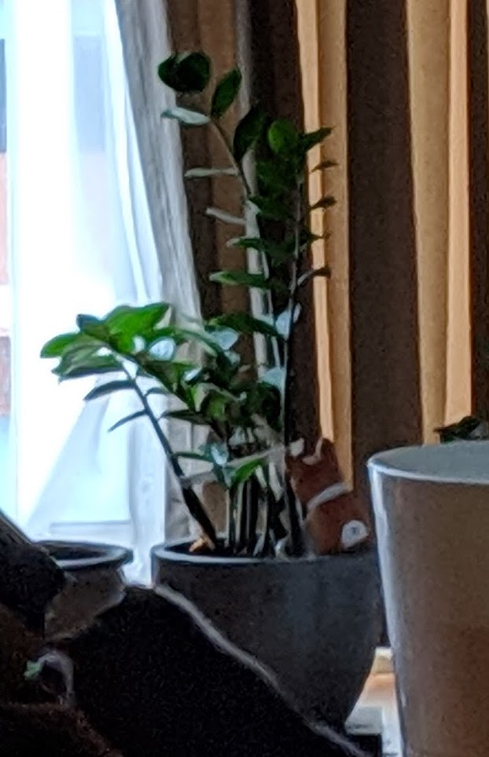
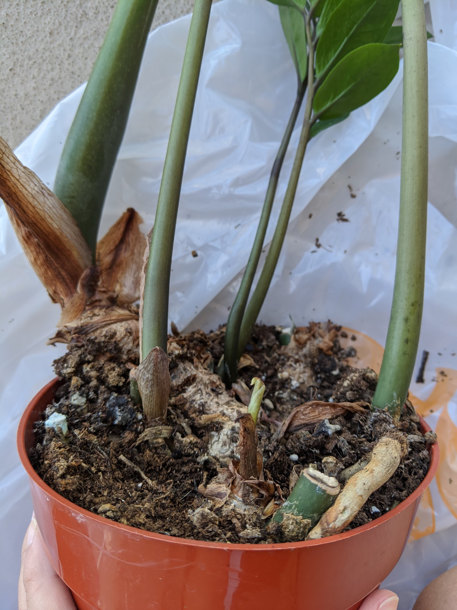
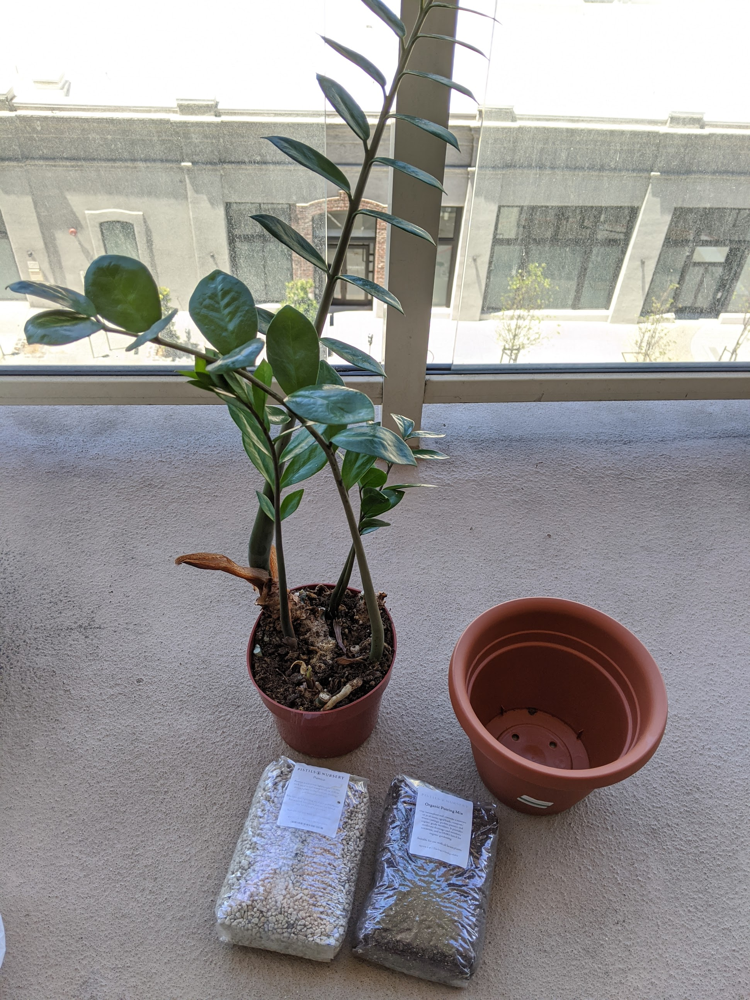
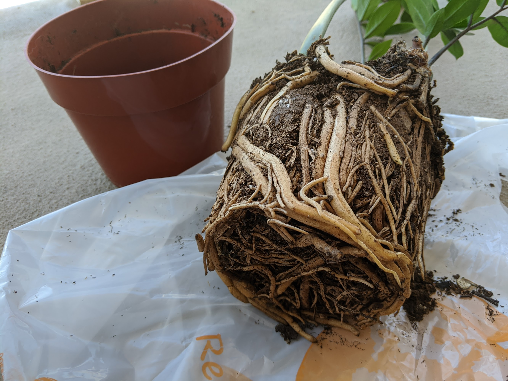
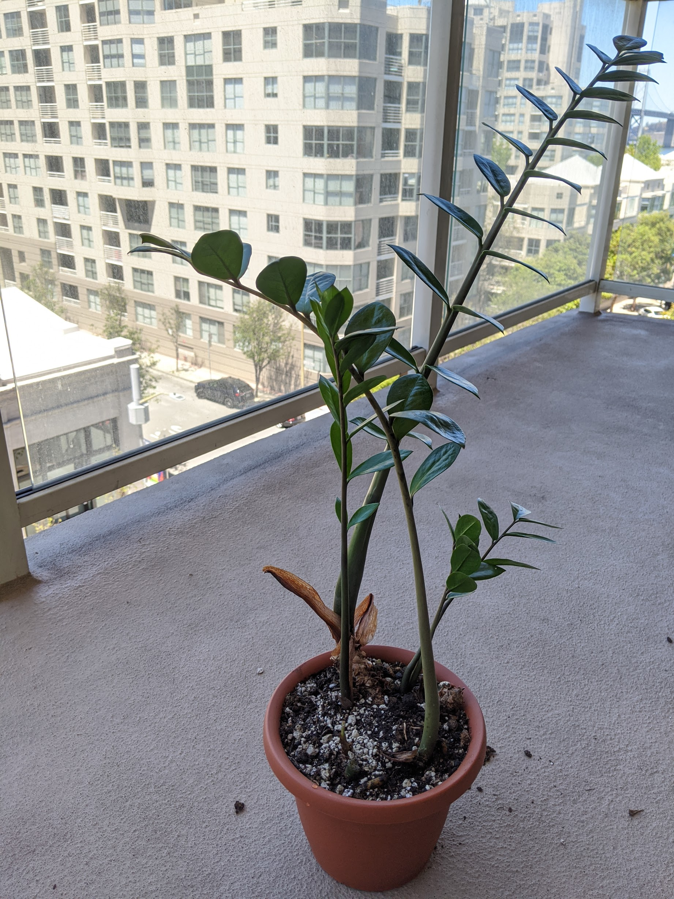

## Adoption in 2017

I adopted this ZZ plant (Zamioculcas zamiifolia) from a previous employer back in 2017. It lived in a 6 inch pot in the office's kitchen/conference room facing a northwest window. Across the street was an alleyway and a tall building, so it did not get much light. Most of it was ambient and bouncing off the walls of that building.

I think it had been thirsty for a long time because it was losing a lot of stems. I recall it only had _three_. I took it with me when I left the office because the previous owner had abandoned it and I thought I could give it a nicer home. Unfortunately, I cannot find photos of it from 2017. I switched over from my iPhone to a Pixel at this point and cannot access those photos on my external hard drive (which is also super old).

## Photos from 2018

At this point I had it for about 8 months and it was growing like crazy.

  <figure class="img--project">
    
    <figcaption>ZZ plant facing a screened northwest window in February 2018</figcaption>
  </figure>
  <figure class="img--project">
    
    <figcaption> A closer look of the plant in January 2018</figcaption>
  </figure>

It sounds weird to me when people say their ZZ plant does nothing for them. I was seeing a ton of new unfurling growth! You can see the old stump from the areas that died off when I adopted it and signs of that giant tuber peaking out of the soil. I didn't think much of it at the time because I was still seeing so much growth and didn't want to disturb the pot.

Here are a couple lower quality photos I found of my ZZ plant in the background of other photos later in 2018.

  <figure class="img--project">
    
    <figcaption>ZZ August 2018</figcaption>
  </figure>
  <figure class="img--project">
    
    <figcaption>ZZ November 2018</figcaption>
  </figure>

## Now in 2020

Fast-forward to 2020, I noticed the giant tuber (rhizome) was starting to bend and grow out of the plastic planter. A root also tunneled out and back into the pot! Also, it had stopped pushing out new growth and many of the stems died off. I have this plant out with my sister's plants too and so I think she would also water my plants. We might've started to over water it because I remember yellowing leaves on many of the stems.

It was worrying me, and I had it for 2 years now, so I was thinking the roots were really bound and needed more space.

Materials:

- 8 inch plastic pot from [San Lorenzo Garden Center](https://www.sanlorenzolumber.com/)
- Soil and pumice from [Pistils Nursery](https://pistilsnursery.com/) - I had a coupon and wanted to try their mixes

Check out these amazing roots. They bound to the shape of the pot and there's barely any soil substrate here!

The new pot wasn't that much larger than the previous, but I hope it is enough for the plant to grow in nicely and be happier. Here are the steps I took to replant:

1. Remove the ZZ plant from its current pot and loosened some of the roots. I didn't water it beforehand because I honestly didn't know if it was already watered or overwatered.
1. Put an inch or so of the soil + pumice mixture into the bottom of the new pot.
1. Placed the plant into center of of the pot. The top of the plant was about an inch below the top of the new pot.
1. Filled in the sides of the pot with the extra soil + pumice mix. The gap was not that big, so I didn't nede to use too much soil.
1. Place a shallow layer of the soil + pumice mixture onto the top of the plant to cover the exposed rhizome.

This plant has been repotted for a week now and so far no problems! I actually think the plant is happier now, but that could just be me being a helicopter plant mom. I'll have to provide an update some time in the future.

## Other references

The [Swedish Plantguys](https://www.youtube.com/watch?v=VJoyaUz1hYU) released an awesome informative video on ZZ plant and care. I didn't realize the plant could flower until I saw this video! I highly recommend giving it a watch if you want more information about the ZZ.
