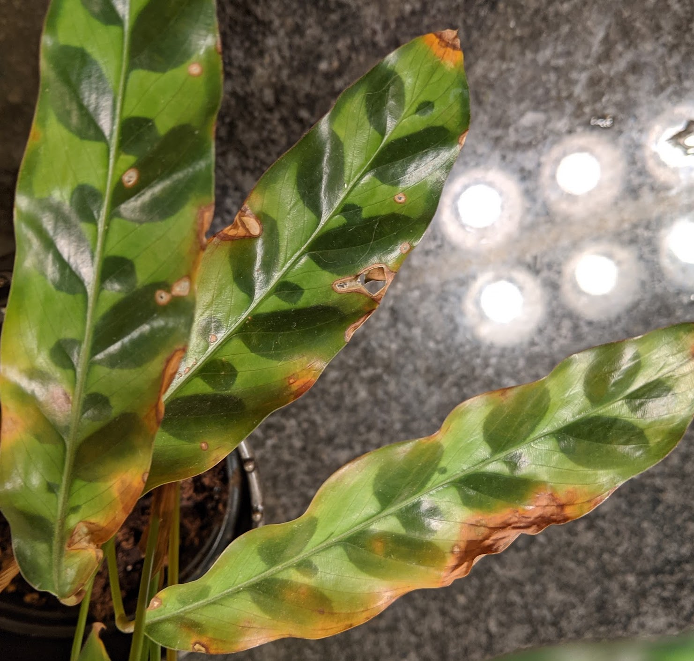
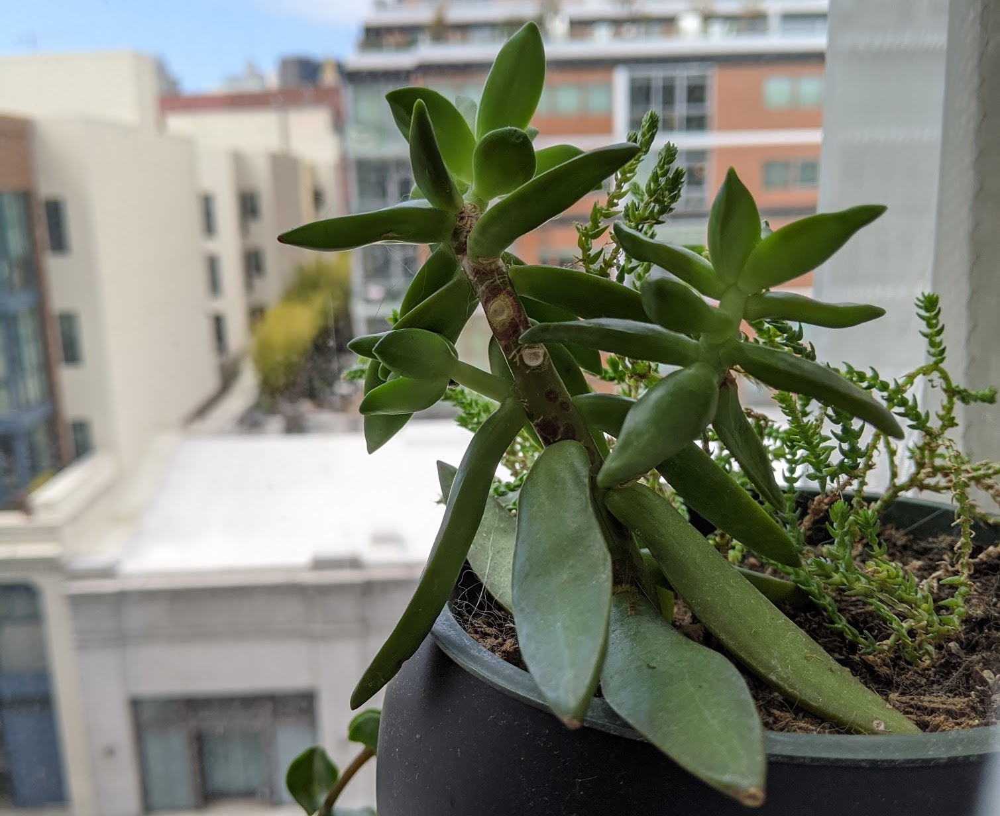
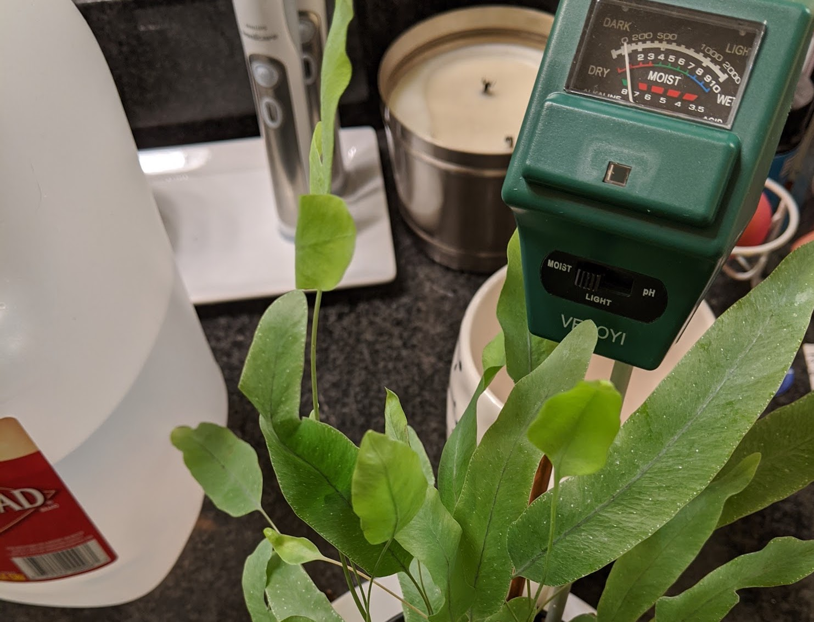
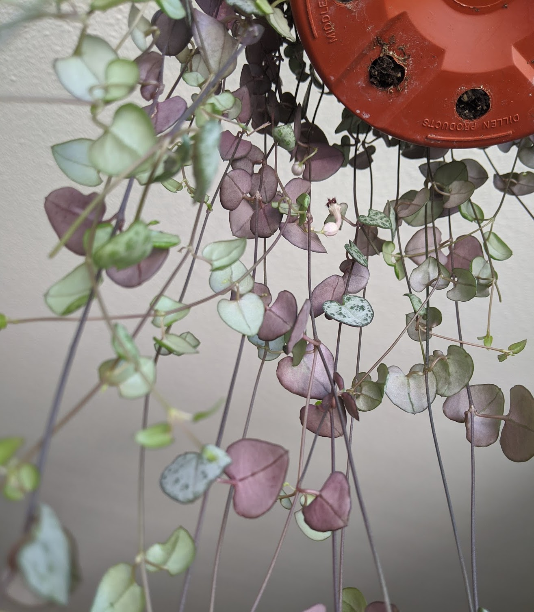
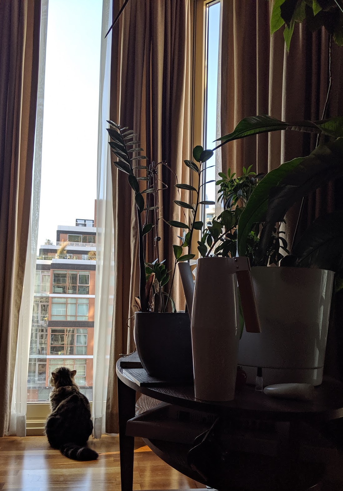
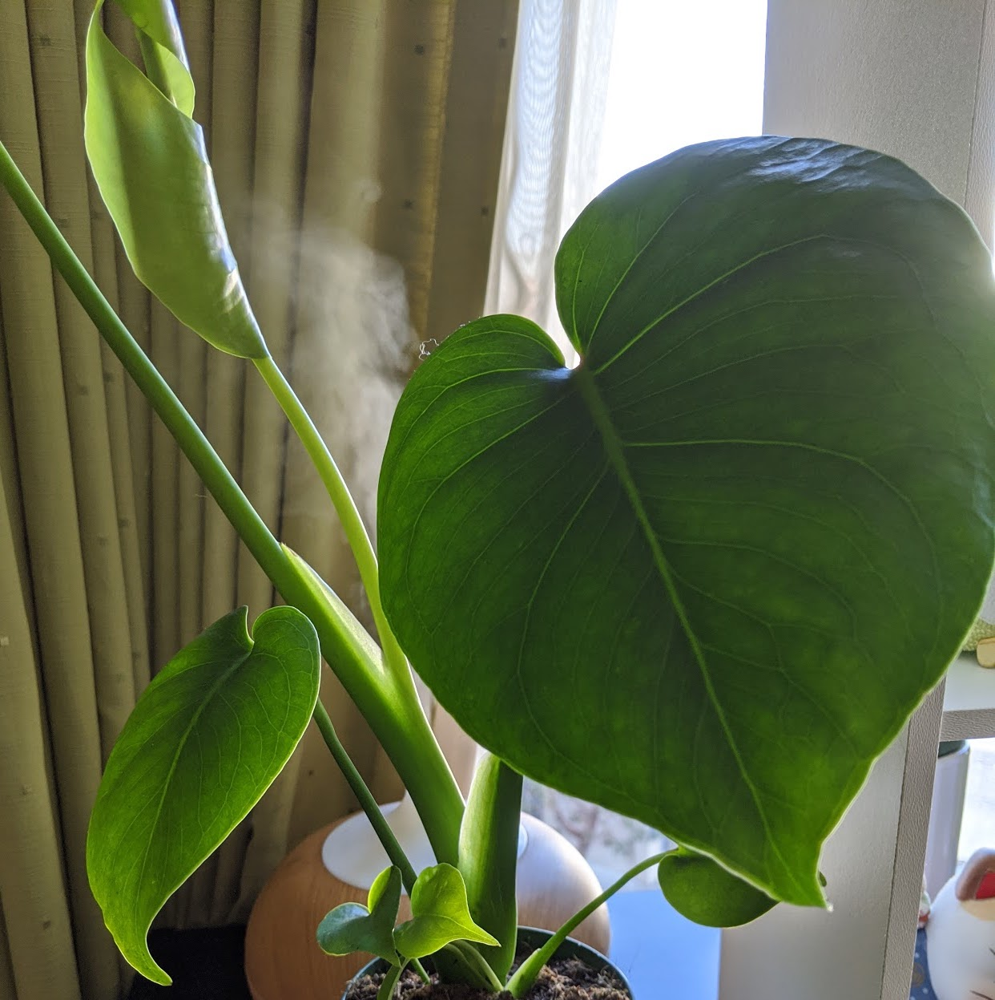
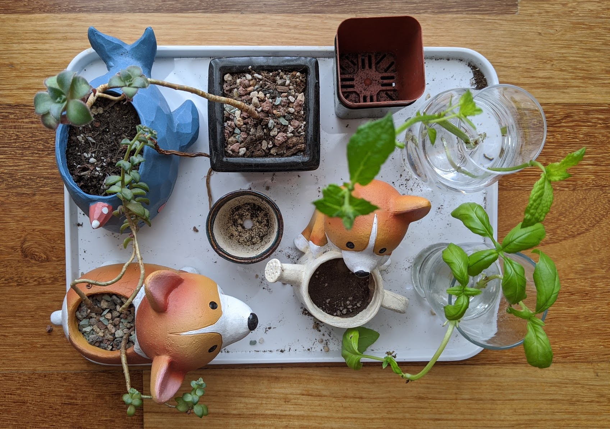
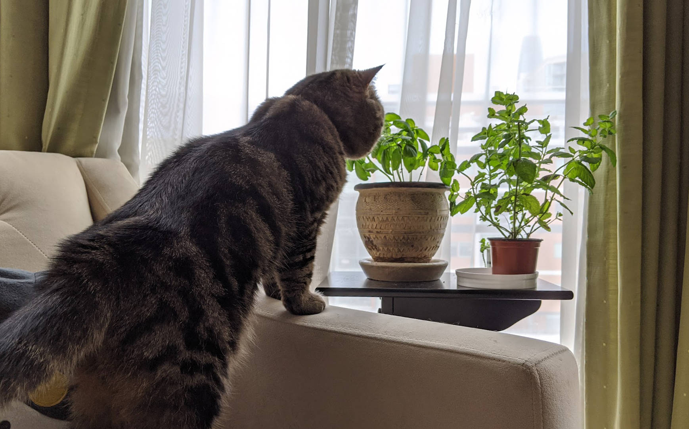
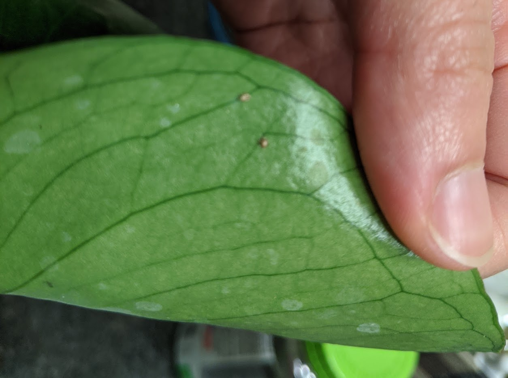
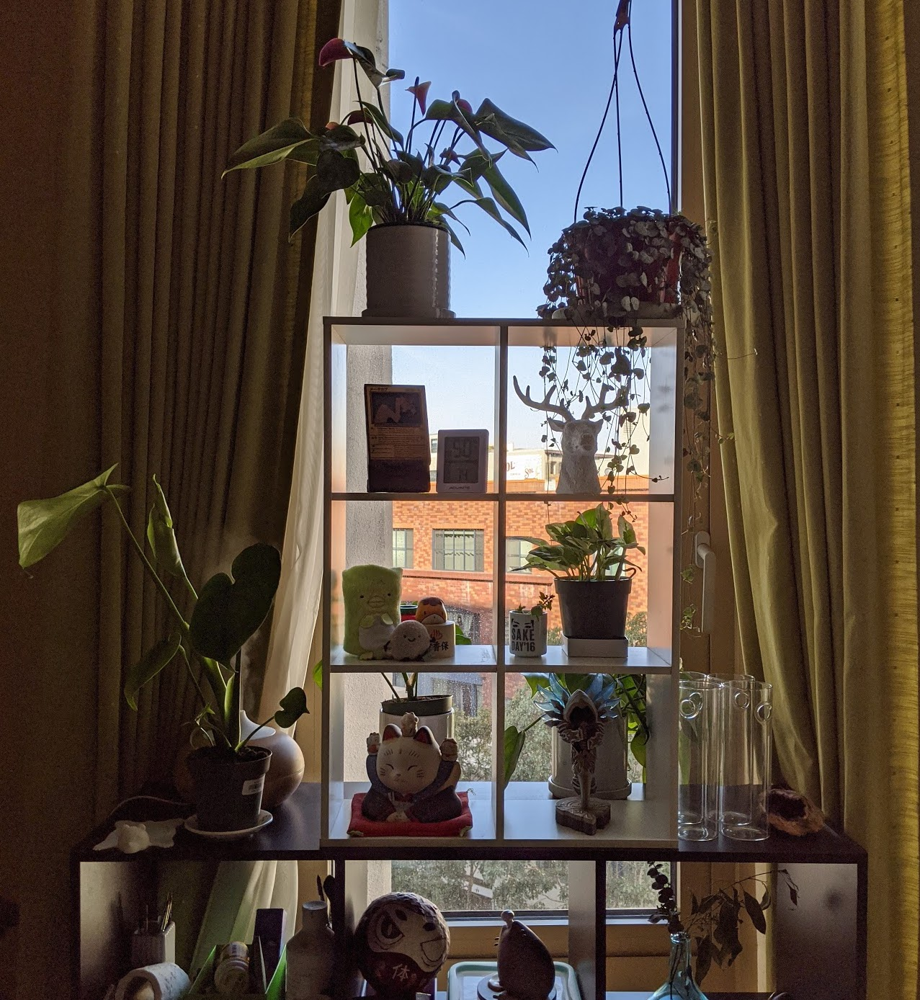

A person with a green thumb is defined to be someone excellent at taking care of plants. They have an uncanny ability to help plants thrive and do their best.

The opposite of a green thumb is a black thumb: the inability to make plants grow. They have the unfortunate tendency to fail at taking care of their plants' health. These "black thumb" people are most likely one or all of the following:

1. Apathetic
2. Uninformed

These traits risk the longevity and livelihood of plants. It sucks and is very demotivating if someone aspires to be a green thumb!

This post will help build a foundation for making your way to a more successful plant parent. Spoiler alert: it's not that secret once you understand the basics! Let's define the habits of a person who can help their plants flourish.

#### TL;DR: Check your plants if they:

- Need watering (inspect the soil's dryness before watering!)
- Need to be moved closer or further from light
- Need more humidity
- Have pests

<figure>
  
  <figcaption>Crispy rattlesnake plant leaves from watering with tap water</figcaption>
</figure>

Disclaimer: these are the experiences of someone growing a knack for taking care of aroids and raising herbs from seed indoors!

## Apathy vs. Love

Your plants need care. Some are fussier than others (I'm looking at you, calathea), but some don't need much attention at all! Regardless, plants displaced from their natural habitat need a bit of help. Forgetting about them and/or not knowing their care instructions can:

- Cause under or overwatering
- Cause discolored foliage
- Cause stunted or leggy growth
- Cause disease

All of the above equate to damage, and in the worst case, death.

<figure>
  
  <figcaption>Leggy succulents from lack of sunlight</figcaption>
</figure>

However, some plants will give you more _love_ than the amount of effort you put in. Some examples?

- They will live regardless of how little light you give it.
- They will forgive you if you forget to water.
- They push out foliage like its no one's business.
- They are happy to be root bound in their home.

Some people call these the "set it and forget it plant." You very seldom need to give them some attention. Some plants are simpler to take care of than others because of their simple maintenance.

## Build the right environment

The first step to help build an environment for your plants to thrive is to pay attention to how your plants are doing.

- Look at the leaves: Are they crispy? Are they wilted?
- Are there pests on the plant? In the soil? On the pot?
- Look at their surroundings. Do they have room to breathe?
- Check out their lighting.
- Stick your finger in the soil. Is it dry or still wet?
- Get a feel for the air. Is it too dry?

<figure>
  
  <figcaption>Checking the moisture level of my blue star fern</figcaption>
</figure>

Unsure of how to answer or address any of your observations? Excellent, the next section will tie in your concerns with actions that will allow you to care for your plants properly.

## Providing proper care

Hopefully, observation of your plants will inspire you to look up their primary care instructions.

<figure>
  
  <figcaption>Underside of string of hearts</figcaption>
</figure>

Functional requirements to think about are:

1. Best lighting conditions (and the lowest tolerable)
2. Watering needs
3. Best substrate/growing medium
4. Humidity levels

Every plant is different, so do some research for each of your plants. For example:

- Did you know most indoor plants can't be in direct sunlight for extended periods? Their leaves will burn!
- Did you know specific substrate/soil mixes retain moisture better? Did you know some drain quicker? Did you know different plants like soil moister than others?
- Did you know some plants are more prone to root rot? Did you know different substrates can help mitigate that?
- Did you know some plants like higher humidity levels to either thrive or even survive? Like 70%?

## Things you can control, sort of!

There are solutions to help build an environment to better suit your plants' needs!

- **Natural Light**: figure out the directions your windows face! See which receive the most significant/smallest amounts of light. EG, if you live in the northern hemisphere, southern facing windows will expose you to the most. Likewise, the north window will get the least. If you live in the southern hemisphere, flip this around.

<figure>
  
  <figcaption>Morning light from a north-western facing window</figcaption>
</figure>

- **Artificial light**: you can purchase grow lights to provide the light your plants can't receive from their environment. Nothing beats real sunlight, but some light is better than none!

- **Humidity**: most aroids are from tropical and sub-tropical regions and require higher levels of humidity. To mimic those environments, if you live in a drier climate, you would need a humidifier.

<figure>
  
  <figcaption>Reusing my oil diffuser (without the oils!) to humidify my plants</figcaption>
</figure>

- **Substrate/Growing medium**: If the medium your plant is living in is retaining too much or too little moisture, plan to switch to something that makes more sense!

Trying to mimic the climate your plants originally came from will help your plants live their best.

## Secondary important plant things

- Note toxicity to children and pets (and where you place plants that are toxic)
- Common pests: Identification and removal (chemical vs. organic vs. biocontrol)
- Fertilizer: What is NPK? What ratios should you use?
- Propagation: The most rewarding second to health!

<figure>
  
  <figcaption>Curious cat smelling herbs</figcaption>
</figure>

## Informational things regarding new plants

- Inspect everything for pests: the foliage, stems, flowers, petioles, the gap where the petioles attach to the stem, air roots, all the things, even the soil!

<figure>
  
  <figcaption>Me inspecting the underside of a leaf of my young monstera deliciosa</figcaption>
</figure>

- Did you know you shouldn't immediately re-pot your plants after purchasing them from a nursery? They need time to acclimate to their new environment. Plants get stressed too!
- When you do repot, please check to see what substrate works best for your plant! Look especially at the moisture retention levels.

## The most common black thumb story

The number one reason why I have killed plants in the past wasn't that I was apathetic; it was because I was uninformed of how much I was overwatering my plants! Turns out I'm not alone!

I imagine they were drowning and died because of root rot. Sometimes I watered the plant because I didn't do it at least two days ago, no rhyme or reason. Sometimes the plants didn't have a space to drain that excess water because I re-potted them in a pretty pot without drainage holes. Simply put, I didn't have a good idea of when my plants should have been watered.

Solution: Just remember every plant and every environment is different, so you need to observe your plants and their substrate to see if they:

- Need watering (Check if the soil is dry before watering!)
- Need to be moved (closer or further from light)
- Need more humidity

## An actual secret

[Darryl](https://www.instagram.com/houseplantjournal/) said something that ran true for me:

> There is one universal truth to those with green thumbs. They have either: large windows OR grow lights.

I have to agree because there's no other way around it!

You cannot have plants without a source of light! Even if some plants _tolerate_ low light, they still need light to make food! One thing is for certain: your plants with thrive if they are provided better lighting. They will produce so much growth for you.

## Good luck

I hope you learned something new today or were inspired to learn a bit more about your plants and are excited to continue your plant journey!
