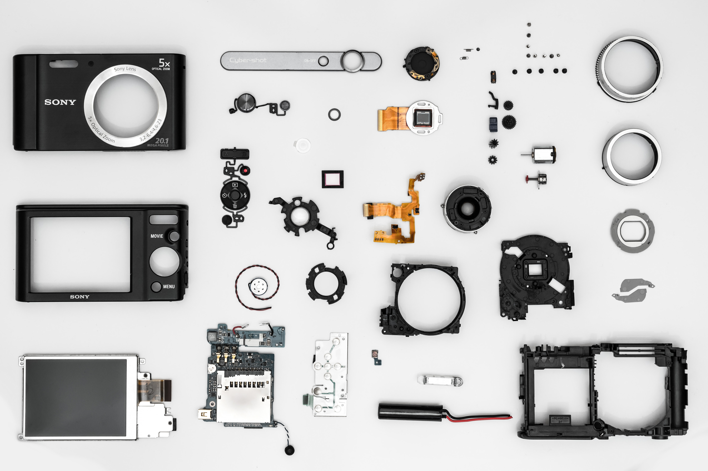

When I joined the Customer Experience team to build a new component library, we quickly found a need to publish a style guide. What is it, you ask? I will cover what it is and why we needed one!

<figure>
  
  <figcaption>Like many things, a camera is less complicated when you break it down into simple components. Photo by <a href="https://www.pexels.com/@freecreativestuff">@freecreativestuff</a></figcaption>
</figure>

## Purpose: Why is a style guide being made?

To assist in quickly designing, prototyping and deploying digital products using a baseline of design patterns.

## What is a style guide?

The style guide is the living and growing single source of truth for determining the product’s UI and how it is presented. It supports the primary purpose by:

- Removing the guesswork for how certain components look and behave under certain states showcased by our component library.
- Reusing code so styles and components aren’t reinvented.
- Socializing the style guide and its patterns in one place so teams speak the same language and share the same expectations.
- Showing live component examples, allowing the user to interact with various elements to understand look and behavior.
- Showing code snippets alongside components for a contextual understanding of implementation.
- Standardizing guidelines for global styles, such as layout grids, breakpoints, colors, typography and more.
- Document accessibility (a11y) practices and support.

<figure>
  
  <figcaption>A simple, clear, and helpful direction. Photo by <a href="https://www.pexels.com/@jens-johnsson-14223">@jens-johnsson-14223</a></figcaption>
</figure>

## The style guide is NOT:

- Your frontend UI solution or a UI framework (like Bootstrap). It is meant to supplement the developer's presentation layer and to standardize the designers’ mocks.
- Your component library. The style guide itself is a consumer! The Component Library is a separate package you can import into your project to use.
- A place where you request new components/elements and behavior changes. If you have any suggestions or concerns, please work with the designers first.
- A place for referencing the best-practices for the digital brand.
- Meant to stifle creativity and innovation. Think of it as a baseline that can adapt to our products’ needs over time.
- Meant to teach people how to code. There are other websites and classes with thorough curriculums for learning. The style guide is a reference that describes and - hands you the building blocks for maintaining our UI, but it is not a tool used to help you learn how to code Javascript and HTML/CSS, run build tools, etc.

## Target Audience (Who is it for?)

The style guide is meant to be used by anyone involved with the product that needs to design, implement, edit, and review a UI.

<figure>
  
  <figcaption>Teamwork requires people. Photo by <a href="https://www.pexels.com/@kaboompics">@kaboompics</a></figcaption>
</figure>

This includes, but is not limited to, the following roles:

- Designers: to quickly produce mockups as well as live prototypes (if needed). It should allow non-technical people the ability to simply add a script or stylesheet into the HTML header and consume bits in the markup copied from the code snippet areas.
- Developers: to reference components for building UIs.
- QA: to assert behavior and style of specific components.
- PMs: to use as a reference implementation for testing project/feature UIs and to grab certain elements, if building prototypes.

## Who is making and maintaining it?

Overall, a senior designer and the front-end developer (me) will own and maintain the style guide and component library.

Below are the basic iterative steps for how the style guide will be developed and improved:

- The CX team of designers will work with the product team to design mockups for new features, workflows, and/or projects.
- If a new element (or state/behavior) is found, it will be evaluated and determined whether or not changes/additions will make it into the library.
- A frontend developer will implement the new changes and add them to the component library. It will then be reviewed by peers and merged.
- The style guide will be updated reflecting the above.
- Consumers of the component library and style guide will be notified of the update.

Wash and repeat.

## Criteria/flow for adding new elements, behavior, or state to the style guide

- Is a similar element/system already in the style guide? If so, can you use that instead?
- If not, then determine the use case(s) for your proposal.
- Meet with style guide designers and determine where to go from there.
